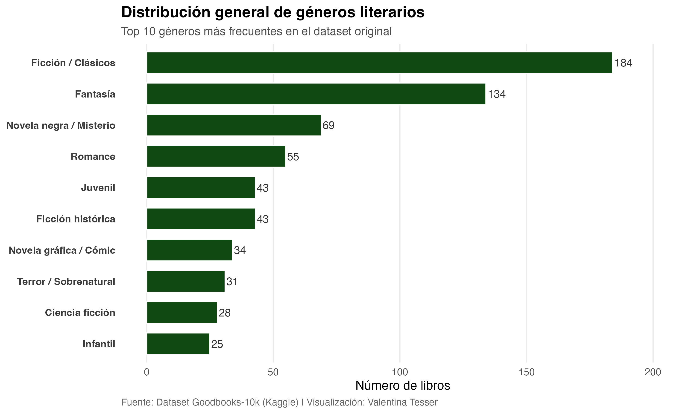
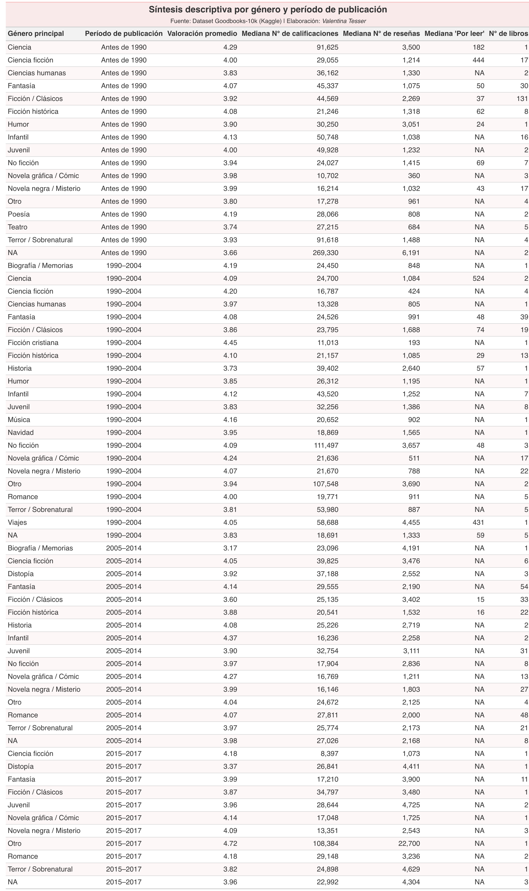
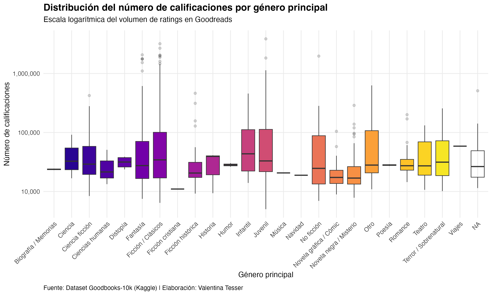
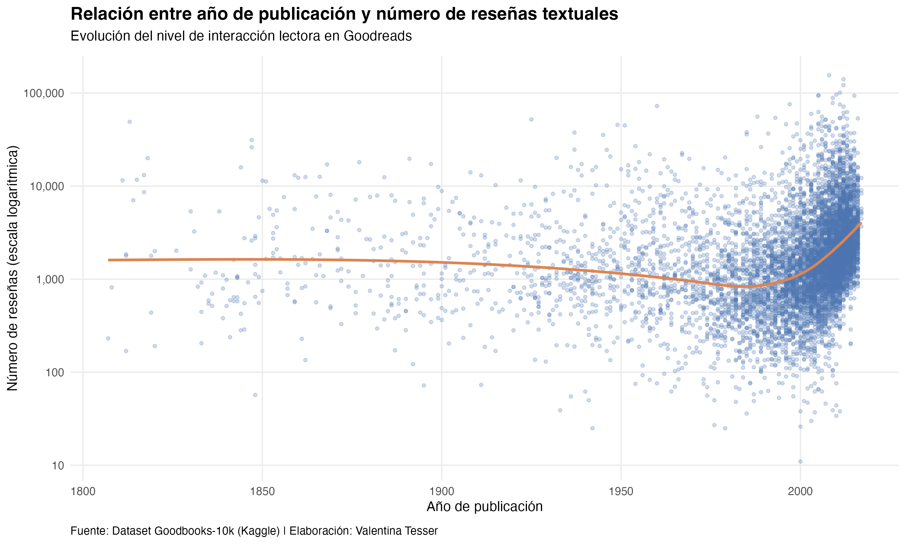

# Explorando el dataset Goodbooks-10k 📚

-   Autor: Valentina Tesser
-   Fecha última actualización: 7 de diciembre de 2025

<details>
  <summary><strong>1. Introducción</strong></summary>
  
## 1. Introducción

¿Alguna vez te has preguntado qué tipo de libros son los más populares o cuáles son los que más personas tienen pendientes de leer?
En la era digital, estas preguntas pueden responderse no solo con intuiciones, sino también con datos.
En este proyecto, me propuse analizar una gran base de datos proveniente de **Goodreads**, una de las plataformas más utilizadas por lectores de todo el mundo para registrar, calificar y recomendar libros.

El dataset que utilicé **Goodbooks-10k**, disponible públicamente en Kaggle (<https://www.kaggle.com/datasets/zygmunt/goodbooks-10k>), recopila información de más de **10.000 libros** junto con sus autores, valoraciones promedio, número de reseñas, etiquetas (géneros o temas) y datos de interacción de los usuarios, como los libros marcados como por leer.
Este tipo de información abre una ventana fascinante para entender los **patrones de lectura y popularidad literaria** a escala global.

Mi idea fue transformar este conjunto de datos en una **historia contada con R**, mostrando paso a paso cómo explorar, limpiar, integrar y analizar información de una fuente real.
El objetivo no es solo llegar a conclusiones sobre los gustos literarios, sino también **aprender a manipular datos con herramientas del tidyverse**, de modo que cualquier persona interesada en aprender R pueda seguir este proceso como un tutorial práctico.

A lo largo del análisis, busco responder algunas preguntas que van más allá de la simple curiosidad estadística.
Por ejemplo:

-   **¿Qué relación existe entre la valoración promedio de un libro y su nivel de popularidad en Goodreads?**
-   **¿Qué géneros literarios concentran el mayor interés entre los lectores, y cómo se distribuyen dentro del catálogo**
-   **¿Qué factores explican que ciertos títulos despierten una mayor expectativa lectora y sean añadidos con más frecuencia a las listas "to-read"??**
-   **¿Cómo varían las calificaciones y reseñas según el género, autor y año de publicación?**

Estas interrogantes combinan el interés cultural por las preferencias lectoras con un enfoque técnico en análisis de datos.

El resultado es un recorrido completo que comienza con la **preparación y limpieza de las bases**, continúa con su **integración y exploración visual**, y culmina con la **interpretación de patrones y tendencias**.
Todo el proceso se explica en detalle para que puedas reproducirlo y adaptar las técnicas a tus propios proyectos.

En definitiva, este análisis busca demostrar cómo los datos pueden convertirse en una herramienta poderosa para observar el mundo cultural.
A través de Goodreads, podemos entender no solo qué leen las personas, sino también qué **desean leer**, y cómo esas elecciones van moldeando el paisaje literario de una comunidad global interconectada por el amor a los libros.

</details>

<details>
  <summary><strong>2. Estructura del proyecto</strong></summary>

## 2. Estructura del proyecto

Este proyecto se organiza en distintas fases que reflejan el flujo típico de un **análisis de datos en R**, desde la obtención de la información hasta la comunicación de los resultados.
La idea es que cualquier persona que lea este repositorio pueda seguir el proceso paso a paso, entender la lógica detrás de cada decisión y adaptar el código a sus propios intereses.

En la primera etapa, trabajé con los **archivos originales del dataset Goodbooks-10k**, que incluyen información de libros, autores, etiquetas (tags), valoraciones de usuarios y libros marcados como por leer.
Estos archivos fueron cargados y explorados para identificar su estructura, variables y posibles problemas de calidad, como valores faltantes o duplicados.

Luego, en la segunda fase, se realizó la **integración de las bases**.
Esto implicó conectar las distintas fuentes —por ejemplo, uniendo los identificadores de libros con sus etiquetas o consolidando las valoraciones— para construir una base maestra lista para el análisis.
Durante este paso también se seleccionaron las variables más relevantes para responder las preguntas de investigación planteadas, como el promedio de calificaciones, el número de reseñas, el año de publicación y el género principal de cada obra.

Finalmente, el proyecto avanza hacia la fase de análisis y visualización, donde se aplican herramientas de manipulación y graficación (principalmente del paquete tidyverse) para descubrir patrones y tendencias en los datos.
Esta parte incluye comparaciones entre géneros literarios, evolución temporal de las publicaciones y exploración de los libros más populares según distintos criterios.

En cada etapa, el código está acompañado de **comentarios explicativos y observaciones sobre los resultados intermedios**, con el fin de que el lector no solo vea qué se hace, sino también por qué se hace.
De este modo, el proyecto funciona tanto como un ejercicio práctico de análisis de datos en R como una guía para quienes quieran iniciarse en la exploración de datasets reales.

El repositorio está estructurado de la siguiente manera: - **Data**: Carpeta que contiene los archivos originales del dataset Goodbooks-10k en formato CSV.
- **Scripts**: Carpeta con los scripts de R utilizados para la limpieza, integración y análisis de los datos.
- **Data Limpia**: Carpeta donde se guardan las bases de datos ya limpias y listas para el análisis.
- **Outputs**: Carpeta donde se guardan las visualizaciones y resultados generados durante el análisis.
- **README.md**: Este archivo, que proporciona una visión general del proyecto y su estructura

</details>

<details>
  <summary><strong>3. Base de datos</strong></summary>

## 3. Base de datos

**Goodbooks-10k dataset**: El dataset Goodbooks-10k es una colección de datos que contiene información sobre más de 10,000 libros, sus autores, calificaciones y etiquetas (tags) asociadas.
Este conjunto de datos es ideal para realizar análisis exploratorios y visualizaciones relacionadas con la popularidad y características de los libros.

El dataset incluye los siguientes archivos principales:

-   **books.csv**: contiene información sobre los libros, incluyendo sus títulos, autores, años de publicación y calificaciones promedio.
-   **books.tags.csv**: contiene etiquetas asociadas a los libros, que pueden ayudar a categorizar y analizar los géneros y temas de los libros.
-   **ratings.csv**: contiene las calificaciones que los usuarios han dado a los libros, lo que permite analizar la popularidad y recepción de los libros.
-   **tags.csv**: contiene las etiquetas que los usuarios han asignado a los libros, lo que puede proporcionar información adicional sobre los temas y géneros de los libros.
-   **to_read.csv**: contiene una lista de libros que los usuarios han marcado para leer en el futuro, lo que puede proporcionar información sobre las tendencias y preferencias de lectura.

Puedes descargar el dataset completo desde Kaggle en el siguiente enlace: <https://www.kaggle.com/datasets/zygmunt/goodbooks-10k>.
Asegúrate de guardar los archivos CSV en la carpeta "Data" del repositorio para que los scripts puedan acceder a ellos correctamente.

### 3.1 Limpieza e integración de las bases de Goodreads

Antes de explorar los datos y crear visualizaciones, se realizó un **proceso de limpieza y preparación** de las cinco bases principales del dataset Goodbooks-10k.
Este paso es crucial para asegurar que los análisis sean consistentes y representativos, aunque los detalles del código estén disponibles en los scripts de la carpeta `Scripts`.

#### 3.1.1 Limpieza de cada base

Durante la limpieza se realizaron las siguientes acciones principales:

-   **Filtrado de años válidos:** Se conservaron solo libros publicados entre **1800 y 2017**, eliminando registros fuera de rango o sin año de publicación. Esto garantiza un rango temporal realista según los datos de Goodreads.\
-   **Eliminación de duplicados exactos:** Se eliminaron registros duplicados en todas las bases por seguridad, aunque la mayoría de los duplicados se encontraba en la tabla `book_tags`.\
-   **Valores críticos faltantes (NA):** Se conservaron únicamente libros con **título y año**, esenciales para cualquier análisis. Otros campos, como ISBN o idioma, se mantienen aunque falten, ya que no afectan el análisis descriptivo principal.\
-   **Revisión de idiomas:** Se identificaron los idiomas más frecuentes y se filtraron los libros en **inglés**, que representa la mayoría de los registros. Además, se homogeneizó la etiqueta de idioma para facilitar el análisis.\
-   **Selección de variables relevantes:** Se redujo cada base a las columnas esenciales para el análisis, por ejemplo, título, autor, año, calificaciones y etiquetas de libros.

Como resultado de este proceso, se generaron las bases limpias: `books_clean.csv`, `book_tags_clean.csv`, `tags_clean.csv`, `ratings_clean.csv` y `to_read_clean.csv`, listas para la integración y análisis posterior.

#### 3.1.2 Integración de las bases limpias

Una vez limpias, las cinco bases se **unieron para crear la base final** que contiene toda la información necesaria para análisis exploratorios y visualizaciones.
Esta base final se llama `books_final_integrated.csv`, pero en los scripts de visualización se utiliza el nombre **`books_full`**.

Los pasos clave de la integración fueron:

-   **Unión con tags:** Cada libro recibió su **tag principal**, es decir, el género o tema más frecuente según la base `book_tags_clean`.\
-   **Agregación de ratings:** Se calculó para cada libro la **valoración promedio** y el **número total de valoraciones**.\
-   **Incorporación de “por leer”:** Se sumó la cantidad de usuarios que marcaron cada libro como “por leer”, como indicador de interés potencial.\
-   **Verificación final:** La base final contiene **8.130 libros y 15 variables**, con información completa de título, autor, año, idioma, género, calificaciones y métricas de interés de los usuarios. Los valores faltantes se concentran principalmente en libros sin calificaciones o sin registros en “por leer”.

La base final está disponible en `Data Limpia/books_final_integrated.csv`.
Todos los pasos de limpieza e integración están documentados en los scripts de la carpeta `Scripts`, para quienes quieran replicar o profundizar en el proceso.

Esta fase asegura que el análisis posterior y las visualizaciones se realicen sobre un dataset **consistente, integrado y representativo**, facilitando la exploración de patrones de popularidad, valoración y preferencias lectoras en Goodreads.

</details>

<details>
  <summary><strong>4. Pasos a seguir</strong></summary>

## 4. Pasos a seguir

Para reproducir el análisis presentado en este proyecto, sigue estos pasos: 

1. Clona o descarga este repositorio en tu computadora.
2. Asegúrate de tener R y RStudio instalados.
3. Instala las librerías necesarias si aún no las tienes:

```{r}
install.packages(c(
  "tidyverse",
  "dplyr",
  "ggplot2",
  "readr",
  "tidyr",
  "summarytools",
  "plotly",
  "scales",
  "htmlwidgets",
  "forcats",
  "stringr"
))
```

4.  Coloca los archivos CSV del dataset Goodbooks-10k en la carpeta "Data" del repositorio.
5.  Abre RStudio y carga los scripts de R desde la carpeta "Scripts" en el orden indicado (limpieza, integración, análisis).
6.  Ejecuta los scripts paso a paso, asegurándote de entender cada sección del código y los comentarios explicativos.
7.  Revisa los resultados y visualizaciones generados en la carpeta "Outputs".

Siguiendo estos pasos, podrás reproducir el análisis y explorar los datos por ti mismo.
No dudes en modificar el código para adaptarlo a tus propias preguntas de investigación o intereses literarios.

¡Feliz análisis de datos!
📊📚

</details>

<details>
  <summary><strong>5.Explorando la relación entre valoración y popularidad en Goodreads</strong></summary>

## 5.Explorando la relación entre valoración y popularidad en Goodreads

Una de las preguntas más interesantes que surgen al analizar el dataset *Goodbooks-10k* es: **¿Qué relación existe entre la valoración promedio de un libro y su nivel de popularidad entre los usuarios?**

En otras palabras, buscamos saber si los libros más populares (aquellos con más calificaciones o reseñas) son también los mejor evaluados.\
Esta pregunta nos permite acercarnos a la dinámica de comportamiento lector dentro de Goodreads: ¿la visibilidad impulsa la valoración positiva, o los usuarios prefieren calificar mejor obras menos masivas?

### 5.1 Limpieza y observaciones iniciales

Antes de comenzar con los gráficos, revisé la estructura de las variables principales del análisis:

-   `avg_rating`: valoración promedio de cada libro.\
-   `n_ratings`: número total de valoraciones recibidas.\
-   `n_to_read`: número de usuarios que marcaron el libro como *“por leer”*.

**Observación:**\

-   `avg_rating` contiene **7474 valores NA**.

-   `n_ratings` contiene **7474 valores NA**

-   `n_to_read` contiene **7475 valores NA**

Estos *NA* corresponden a **libros que no han recibido calificaciones ni han sido marcados como “por leer”**.
Por lo tanto, en los gráficos siguientes se trabajará solo con los registros completos, utilizando `filter(!is.na(avg_rating))` y `filter(!is.na(n_ratings))` para asegurar que los resultados sean representativos.

### 5.2 Objetivo analítico

El objetivo de esta sección es identificar si existe una relación (lineal o no) entre la *valoración promedio* y la *popularidad* de los libros en Goodreads.
Para ello, exploraremos visualmente los datos y luego cuantificaremos la correlación entre ambas variables.

### 5.3 Visualización y analisis:

-   [1. Diagrama de dispersión: popularidad vs. valoración promedio](#531-diagrama-de-dispersión-popularidad-vs-valoración-promedio)
-   [2. Densidad bivariada: concentración de libros](#532-densidad-bivariada-concentración-de-libros)
-   [3. Scatterplot con línea de tendencia (geom_smooth)](#533-scatterplot-con-línea-de-tendencia-geom_smooth)
-   [4. Relación entre valoración promedio, popularidad anticipada y visibilidad (`n_ratings`)](#534-relación-entre-valoración-promedio-popularidad-anticipada-y-visibilidad-n_ratings)
-   [5. Correlación entre valoración promedio y número de valoraciones](#535-correlación-entre-valoración-promedio-y-número-de-valoraciones)
-   [6. Los libros más populares vs. los mejor calificados](#536-los-libros-más-populares-vs-los-mejor-calificados)

#### 5.3.1 Diagrama de dispersión: popularidad vs. valoración promedio

El siguiente gráfico muestra cómo se distribuyen los libros en función de su número de valoraciones (`n_ratings`) y su calificación promedio (`avg_rating`).

```{r}
books_clean <- books_full %>%
  filter(!is.na(avg_rating), !is.na(n_ratings))

ggplot(books_clean, aes(x = n_ratings, y = avg_rating)) +
  geom_point(alpha = 0.4, color = "#0072B2") +
  scale_x_log10() +
  labs(
    title = "Relación entre popularidad y valoración promedio en Goodreads",
    x = "Número de valoraciones (escala logarítmica)",
    y = "Valoración promedio",
    caption = "Fuente: Dataset Goodbooks-10k (Kaggle) Visualización: Valentina Tesser"
  ) +
  theme_minimal() +
  theme(
    plot.title = element_text(face = "bold", size = 16)  # negrita y tamaño opcional
  )
```


En el gráfico de dispersión, donde cada punto representa un libro, se observa una alta concentración entre las 100 y 1.000 valoraciones (recordando que el eje X está en escala logarítmica).
Esto significa que la mayoría de los títulos del dataset son moderadamente populares, sin llegar a los niveles masivos de lecturas que tienen algunos best-sellers.

En cuanto a las valoraciones promedio (`avg_rating`), la mayoría de los libros se ubica entre 3,0 y 4,5 estrellas, lo que refleja una tendencia general positiva: los usuarios de Goodreads tienden a evaluar los libros con buenas calificaciones, aunque no con puntuaciones extremas.

También se pueden notar algunos valores atípicos —libros con muchas valoraciones pero calificaciones más bajas, o al contrario, libros con muy pocas valoraciones pero con promedios cercanos a 5 estrellas—.
Esto puede deberse a fenómenos distintos: los primeros suelen ser títulos muy conocidos pero polarizantes (por ejemplo, sagas populares o libros con adaptaciones cinematográficas), mientras que los segundos suelen ser libros de nicho, leídos por pocos usuarios pero muy apreciados por ellos.

En síntesis, la concentración de puntos muestra que la mayoría de los libros tiene una recepción positiva pero una visibilidad limitada, y que la popularidad extrema es la excepción.

Igualmente, podemos ver mejor los datos en el siguiente gráfico:

```{r}

p <- ggplot(books_clean, aes(
  x = n_ratings,
  y = avg_rating,
  text = paste(
    "Título:", title,
    "<br>Autor:", authors,
    "<br>Valoración promedio:", round(avg_rating, 1),
    "<br>Número de valoraciones:", n_ratings
  )
)) +
  geom_point(aes(color = avg_rating), alpha = 0.6, size = 2) +
  scale_color_gradient(low = "#1ABC9C", high = "#E91E63") +
  scale_x_log10(labels = scales::comma) +
  labs(
    title = "Popularidad vs Valoración Promedio de Libros en Goodreads",
    x = "Número de valoraciones (escala logarítmica)",
    y = "Valoración promedio",
    color = "Valoración promedio",
    caption = "Fuente: Goodbooks-10k (Kaggle). Visualización: Valentina Tesser"
  ) +
  theme_minimal(base_size = 14)

# Convertir a objeto plotly
ggplotly_p <- ggplotly(p, tooltip = "text")
```


Ademas se puede ver el gráfico interactivo: [Ver gráfico interactivo](https://vtesser.github.io/Proyecto-personal/Outputs/grafico_libros_interactivo.html)

Donde observamos la misma tendencia que en el gráfico anterior, pero con la ventaja de poder explorar cada punto individualmente al pasar el cursor sobre ellos.
Esto permite identificar títulos específicos, sus autores y detalles de valoración y popularidad.

#### 5.3.2 Densidad bivariada: concentración de libros

El gráfico siguiente muestra la concentración de títulos en torno a ciertos rangos de popularidad y valoración promedio.

```{r}

ggplot(books_clean, aes(x = n_ratings, y = avg_rating)) +
  geom_bin2d(bins = 30) +
  scale_x_log10() +
  scale_fill_gradient(low = "lightblue", high = "darkblue") +
  labs(
    title = "Distribución conjunta de valoración promedio y popularidad",
    x = "Número de valoraciones (escala logarítmica)",
    y = "Valoración promedio",
    fill = "Frecuencia",
    caption = "Fuente: Dataset Goodbooks-10k (Kaggle)"
  ) +
  theme_minimal()

```


El gráfico de densidad bivariada muestra prácticamente la misma tendencia que el anterior, pero con una forma diferente de representación.
En lugar de mostrar puntos individuales, utiliza cuadrantes de color que representan la concentración de observaciones.
Las zonas más oscuras indican donde hay más libros.
En este caso, la concentración principal también está entre 100 y 1.000 valoraciones y calificaciones promedio entre 3,5 y 4,3 estrellas, exactamente como en el gráfico anterior.

Por lo tanto, ambos gráficos entregan la misma información general, pero con distintos propósitos visuales: el diagrama de dispersión es útil para mostrar casos individuales y detectar valores atípicos.
Por otro lado, el gráfico de densidad es mejor para mostrar patrones generales de concentración cuando hay muchos datos y los puntos se sobreponen.

#### 5.3.3 Scatterplot con línea de tendencia (geom_smooth)

El siguiente gráfico presenta la relación entre la valoración promedio (`avg_rating`) y el número de usuarios que marcaron el libro como “por leer” (`n_to_read`).

Cada punto representa un libro, mientras que la línea naranja de regresión muestra la tendencia general según un modelo lineal.

```{r}

ggplot(books_to_read, aes(x = avg_rating, y = n_to_read)) +
  geom_point(alpha = 0.6, color = "#0B5345", size = 3) +
  geom_smooth(method = "lm", color = "#E67E22", linewidth = 1.2, se = TRUE) +
  labs(
    title = "Relación entre valoración promedio y popularidad anticipada",
    subtitle = "Cada punto representa un libro con registro completo en Goodreads",
    x = "Promedio de valoración (avg_rating)",
    y = "Usuarios que marcaron 'por leer'",
    caption = "Fuente: Dataset Goodbooks-10k (Kaggle) | Visualización: Valentina Tesser"
  ) +
  theme_minimal(base_size = 12) +
  theme(
    plot.title = element_text(face = "bold", color = "#2C2C2C", size = 14),
    plot.subtitle = element_text(color = "gray30"),
    axis.text = element_text(color = "#2C2C2C"),
    panel.grid.minor = element_blank(),
    plot.caption = element_text(size = 8, color = "gray40", face = "italic")
  )
```


El gráfico evidencia una relación positiva débil entre el promedio de valoración de los libros y el número de usuarios que los marcan como “por leer”.
La pendiente apenas ascendente de la línea de tendencia sugiere que, en general, los títulos con mejores calificaciones tienden a atraer a más lectores potenciales, aunque la asociación no es lineal ni particularmente fuerte.

Se observan muchos libros con valoración media (entre 3.5 y 4.0) que concentran un rango muy amplio de interés, desde apenas unos pocos registros hasta más de 1500 usuarios.
Esto indica que la expectativa lectora no depende exclusivamente de la calidad percibida, sino también de otros factores contextuales, como la popularidad del autor, la existencia de sagas, o el impacto cultural y mediático de ciertos títulos.

En otras palabras, mientras las obras con alta valoración suelen mantener un interés sostenido, la popularidad anticipada parece estar más vinculada a la visibilidad social del libro que a su evaluación crítica.
Este hallazgo coincide con el comportamiento típico de plataformas como Goodreads, donde las dinámicas de recomendación, tendencia y fandom pueden influir tanto o más que las métricas de calidad.

#### 5.3.4 Relación entre valoración promedio, popularidad anticipada y visibilidad (`n_ratings`)

El siguiente gráfico añade una tercera dimensión al análisis: el tamaño de los puntos representa el número de calificaciones (`n_ratings`) que ha recibido cada libro, permitiendo visualizar simultáneamente popularidad anticipada (`n_to_read`), valoración promedio (`avg_rating`) y visibilidad efectiva en la plataforma.

```{r}
ggplot(books_to_read, aes(x = avg_rating, y = n_to_read, size = n_ratings)) +
  geom_point(alpha = 0.6, color = "#1B5E20") +
  scale_size_continuous(name = "Número de ratings") +
  labs(
    title = "Popularidad potencial vs. valoración promedio y visibilidad",
    x = "Promedio de valoración (avg_rating)",
    y = "Usuarios que marcaron 'por leer'",
    caption = "Fuente: Dataset Goodbooks-10k (Kaggle) | Visualización: Valentina Tesser"
  ) +
  theme_minimal(base_size = 12) +
  theme(
    plot.title = element_text(face = "bold"),
    legend.position = "bottom"
  )
```


El gráfico muestra que los libros con mayor cantidad de calificaciones tienden también a ser los más añadidos a las listas “por leer”, evidenciando una relación entre visibilidad y expectativa lectora.

Aunque existen algunos títulos con alta valoración pero baja notoriedad —indicando interés de nichos más pequeños—, la tendencia general sugiere que la popularidad potencial se concentra en obras ampliamente difundidas o de culto.

Esto refuerza la idea de que el interés por leer un libro no depende solo de su calidad percibida, sino también de factores sociales, mediáticos y de reconocimiento del autor o la saga.

#### 5.3.5 Correlación entre valoración promedio y número de valoraciones

```{r}
cor_test <- cor.test(books_clean$avg_rating, books_clean$n_ratings, use = "complete.obs")
cor_test
```

Se evaluó la relación entre la valoración promedio de los libros y su número de valoraciones en Goodreads utilizando el coeficiente de correlación de Pearson.

| Estadístico                    | Valor            |
|--------------------------------|------------------|
| Coeficiente de correlación (r) | **0.086**        |
| Grados de libertad (df)        | 654              |
| Estadístico t                  | 2.22             |
| p-valor                        | 0.027            |
| Intervalo de confianza (95%)   | [0.0099, 0.1619] |

La correlación entre la valoración promedio (`avg_rating`) y la popularidad (`n_ratings`) es positiva pero muy débil (r = 0.086).
Aunque el p-value (\< 0.05) indica que la relación es estadísticamente significativa, su magnitud es tan baja que no tiene una relevancia práctica fuerte.

En otras palabras, los libros más populares tienden a tener ligeramente mejores calificaciones, pero esta relación es mínima.
Esto sugiere que la popularidad no necesariamente se explica por la calidad percibida, sino también por otros factores —como la promoción editorial, la fama del autor o la pertenencia a géneros con grandes comunidades lectoras—.

#### 5.3.6 Los libros más populares vs. los mejor calificados

Finalmente, podemos visualizar los títulos que lideran ambos rankings y comparar si coinciden o no.

```{r}

# Libros más populares
top_popular <- books_clean %>%
  arrange(desc(n_ratings)) %>%
  slice_head(n = 15)

# Libros mejor calificados (mínimo 1000 valoraciones)
top_rated <- books_clean %>%
  filter(n_ratings > 1000) %>%
  arrange(desc(avg_rating)) %>%
  slice_head(n = 15)

# Crear el gráfico y guardarlo en un objeto
ggplot(top_books, aes(y = title_wrapped, x = n_ratings_plot, color = avg_rating)) +
  geom_segment(aes(x = 1, xend = n_ratings_plot, y = title_wrapped, yend = title_wrapped),
               linewidth = 1.1, alpha = 0.9) +
  geom_point(size = 4) +
  geom_text(aes(label = scales::comma(n_ratings)), hjust = -0.1, size = 3.2, color = "gray20") +
  scale_x_continuous(trans = "log10", labels = scales::comma, expand = expansion(mult = c(0.02, 0.25))) +
  scale_color_gradient(low = "#9DD9D2", high = "#00796B", name = "⭐ Valoración\npromedio") +
  labs(
    title = "Top 15 libros más populares en Goodreads",
    subtitle = "El color indica la valoración promedio; la escala X es logarítmica",
    x = "Número de valoraciones (escala log10)",
    y = "",
    caption = "Fuente: Goodbooks-10k (Kaggle). Visualización: Valentina Tesser"
  ) +
  theme_minimal(base_size = 13) +
  theme(
    plot.title = element_text(face = "bold", size = 16, hjust = 0.5),
    plot.subtitle = element_text(size = 11, hjust = 0.5, color = "gray40"),
    axis.text.y = element_text(size = 10, margin = margin(r = 6)),
    legend.position = "right",
    plot.margin = margin(t = 12, r = 30, b = 12, l = 12),
    panel.grid.major.y = element_blank()
  ) +
  coord_cartesian(clip = "off")
```


El gráfico muestra los 15 libros con mayor número de valoraciones en Goodreads, utilizando una escala logarítmica para representar la cantidad de calificaciones que cada título ha recibido.
El color de los puntos indica la valoración promedio otorgada por los usuarios, permitiendo comparar simultáneamente popularidad y nivel de aprobación.

Se observa que algunos títulos son ampliamente populares, acumulando cientos de miles o incluso millones de valoraciones, mientras que su promedio de calificación no siempre es el más alto.
Esto sugiere que la popularidad no necesariamente refleja una mejor percepción de calidad por parte de los lectores.
En cambio, existen libros con un número más moderado de valoraciones que obtienen puntuaciones notablemente superiores.

Este patrón evidencia que el interés masivo por ciertos títulos —probablemente impulsado por fenómenos editoriales, adaptaciones cinematográficas o autores reconocidos— no siempre se traduce en una evaluación más positiva.
Por tanto, la popularidad en Goodreads parece estar asociada tanto a factores culturales y mediáticos como a la valoración literaria en sí misma.

En resumen, la relación entre popularidad y valoración es compleja: los libros más leídos y comentados no necesariamente son los más apreciados, lo que refleja la diversidad de gustos y expectativas dentro de la comunidad lectora de Goodreads.

### 5.4 Conclusión: Valoración vs. Popularidad

La pregunta central que orientó esta sección fue: **¿Qué relación existe entre la valoración promedio de un libro y su nivel de popularidad entre los usuarios de Goodreads?**

El análisis realizado permite afirmar que dicha relación no es lineal ni directa.
Si bien se observa una tendencia positiva débil —los libros con mejores calificaciones tienden, en promedio, a atraer más lectores potenciales y a recibir más reseñas—, los datos muestran una alta dispersión que evidencia la complejidad de las dinámicas de visibilidad en esta plataforma.

Los gráficos de dispersión y densidad bivariada demostraron que la mayoría de los títulos se concentran en valoraciones medias-altas (entre 3,5 y 4,3 estrellas) y niveles moderados de popularidad, mientras que solo un pequeño grupo de libros —las excepciones o outliers— alcanza cifras de interés masivo.
Estos casos suelen corresponder a franquicias literarias, autores de culto o libros con adaptaciones mediáticas, lo que sugiere que la notoriedad pública del título es un determinante más fuerte que la calidad literaria percibida.

La correlación estadística entre valoración promedio y número de valoraciones **(r = 0.086)** confirma esta observación: aunque la relación es estadísticamente significativa, su magnitud es muy baja, lo que implica que la popularidad no depende estrictamente de la valoración positiva, sino de un conjunto más amplio de factores sociales y culturales.

Asimismo, el gráfico que incorpora el número de calificaciones como medida de visibilidad refuerza la existencia de un fenómeno de retroalimentación social o de “popularidad acumulativa”, donde los libros más visibles tienden a ser aún más visibles.
Esto se alinea con el patrón conocido como winner takes all (“el ganador se lo lleva todo”), propio de los entornos digitales: un número reducido de obras concentra la atención, los comentarios y las futuras lecturas, mientras la mayoría permanece con baja exposición.

Finalmente, el análisis comparativo de los títulos más populares y los mejor calificados muestra que la masividad y la apreciación crítica rara vez coinciden.
Algunos libros logran millones de valoraciones con calificaciones promedio moderadas, mientras que otros, altamente valorados, permanecen en nichos reducidos.
Esto revela que la lectura en Goodreads opera también como un acto social: un espacio donde la visibilidad mediática, la pertenencia a comunidades lectoras y el interés cultural compartido influyen tanto o más que la calidad literaria.

En síntesis, los libros que concentran mayor interés potencial en Goodreads combinan tres dimensiones clave:

-   **Alta visibilidad social y mediática**, que amplifica su alcance más allá de los circuitos literarios.

-   **Pertenencia a sagas, colecciones o autores de culto**, que aseguran reconocimiento y fidelidad de lectores.

-   **Valoraciones positivas —aunque no necesariamente excepcionales—**, que validan el interés sin ser su causa principal.

Este conjunto de hallazgos sugiere que en Goodreads, como en otros ecosistemas digitales, la popularidad anticipada responde más a dinámicas de visibilidad, reputación y consumo cultural compartido que a juicios estrictamente literarios.
En consecuencia, la plataforma refleja no solo preferencias de lectura, sino también procesos sociales de reconocimiento, legitimación y pertenencia simbólica dentro de una comunidad global de lectores.

</details>

<details>
  <summary><strong>6. Entre géneros y tendencias lectoras en Goodreads</strong></summary>

## 6. Entre géneros y tendencias lectoras en Goodreads

Una de las preguntas más sugerentes al explorar el dataset *Goodbooks-10k* es: **¿Qué géneros literarios concentran el mayor interés entre los lectores, y cómo se distribuyen dentro del catálogo?**

### 6.1 Objetivo analítico

El objetivo es visualizar la **distribución de los principales géneros literarios** en Goodreads, observando qué temáticas acumulan más títulos y cómo se posicionan dentro del interés lector general.

A través de esta exploración, se pretende comprender las dinámicas de representación cultural que emergen en la plataforma, considerando tanto la diversidad de categorías disponibles como las tendencias de consumo que priorizan ciertos géneros sobre otros.

**Índice de visualizaciones:**

-   [6.2 Gráfico de distribución original](#63-gráfico-de-distribución-original)
-   [6.3 Gráfico de distribución con nuevo dataset (filtrado)](#64-gráfico-de-distribución-con-nuevo-dataset-filtrado)

### 6.2 Grafico de distribución original

Con este gráfico se busca observar la composición general del dataset original, es decir, cómo se distribuyen los libros según sus géneros sin aplicar ningún filtro sobre las valoraciones (`avg_rating`).

Este primer paso resulta clave para obtener una visión panorámica del conjunto completo de obras, antes de introducir restricciones analíticas.
De esta forma, se pueden identificar patrones de sobre-representación o ausencia de ciertos géneros que podrían deberse al sesgo propio de la plataforma o a la estructura del dataset.

El análisis parte de la premisa de que Goodreads, como comunidad digital, refleja preferencias culturales colectivas, pero también las distorsiona según la popularidad, la traducción de obras o la disponibilidad de ciertos títulos en inglés.
Por ello, mantener inicialmente todos los registros —incluso aquellos sin calificaciones— permite captar el “universo total” del catálogo.

#### 6.2.1 Limpieza y depuración de datos

La limpieza de datos es una etapa fundamental para asegurar la validez del análisis.
En el dataset Goodbooks-10k, los libros están asociados a múltiples etiquetas (tags) asignadas por los usuarios, lo que genera redundancia y ruido semántico.
Por ejemplo, un mismo género puede aparecer bajo distintas variantes (“classic” y “classics”), mientras que otras etiquetas no representan categorías literarias, sino contextos de uso (“book-club”) o nombres de autores (“paulo-coelho”).

El objetivo de esta depuración es estandarizar las etiquetas, agrupando aquellas que refieren al mismo tipo de obra mediante la función case_when().
Asimismo, se eliminan etiquetas genéricas o no literarias para evitar sesgos en la interpretación.

Este proceso mejora la consistencia categorial y permite que los resultados sean comparables y representativos de los géneros propiamente dichos.

```{r}
# Filtrar libros con datos válidos y limpiar etiquetas no literarias
books_genres_original <- books_full %>%
  filter(!tag_name %in% c("to-read", "favorites", "currently-reading"))

# Verificamos las etiquetas 
sort(unique(books_genres_original$tag_name))

books_genres_original <- books_genres_original %>%
  mutate(
    genre_label = case_when(
      # Ficción y subgéneros
      tag_name %in% c("fiction", "classic", "classics", "contemporary", "drama") ~ "Ficción / Clásicos",
      tag_name %in% c("historical-fiction", "historical-romance") ~ "Ficción histórica",
      tag_name %in% c("fantasy", "urban-fantasy", "discworld", "magic-tree-house", "star-wars", "warriors") ~ "Fantasía",
      tag_name %in% c("science-fiction", "sci-fi") ~ "Ciencia ficción",
      tag_name %in% c("dystopia", "dystopian") ~ "Distopía",
      tag_name %in% c("crime", "noir", "thriller", "mystery", "sherlock-holmes", "espionage") ~ "Novela negra / Misterio",
      tag_name %in% c("romance", "paranormal-romance", "chick-lit", "new-adult") ~ "Romance",
      tag_name %in% c("horror", "zombies", "vampires") ~ "Terror / Sobrenatural",

      # Infantil y juvenil
      tag_name %in% c("children", "children-s", "children-s-books", "childrens", "childrens-books", "picture-books") ~ "Infantil",
      tag_name %in% c("ya", "young-adult", "dork-diaries", "39-clues") ~ "Juvenil",

      # No ficción
      tag_name %in% c("non-fiction", "nonfiction") ~ "No ficción",
      tag_name %in% c("biography", "memoir") ~ "Biografía / Memorias",
      tag_name %in% c("history", "india") ~ "Historia",
      tag_name %in% c("philosophy", "psychology") ~ "Ciencias humanas",
      tag_name %in% c("science") ~ "Ciencia",
      tag_name %in% c("music") ~ "Música",
      tag_name %in% c("travel") ~ "Viajes",

      # Otras categorías literarias
      tag_name %in% c("poetry") ~ "Poesía",
      tag_name %in% c("plays") ~ "Teatro",
      tag_name %in% c("humor") ~ "Humor",
      tag_name %in% c("graphic-novel", "graphic-novels", "manga", "mangá", "comics") ~ "Novela gráfica / Cómic",

      # Otros casos específicos
      tag_name %in% c("christian-fiction") ~ "Ficción cristiana",
      tag_name %in% c("christmas") ~ "Navidad",

      # Etiquetas no literarias o nombres de autores
      tag_name %in% c("book-club", "books-i-own", "library", "school",
                      "lee-child", "nicholas-sparks", "nora-roberts", 
                      "sidney-sheldon", "james-patterson", "crossfire", 
                      "david-baldacci", "agatha-christie", "paulo-coelho") ~ NA_character_,
      # Default
      TRUE ~ "Otro"
    )
  )
```

#### 6.2.2 Visualización del gráfico

Una vez limpiados los datos, se calcula la frecuencia de aparición de cada género y se seleccionan los 10 más frecuentes.
El gráfico de barras resultante permite observar de forma clara qué tipos de literatura dominan el dataset original.

Esta visualización tiene un doble propósito:

-   **Descriptivo**, al mostrar el peso relativo de cada categoría dentro del catálogo.

-   **Exploratorio**, al sugerir posibles relaciones entre los géneros más abundantes y los patrones de valoración o lectura que se analizarán más adelante.

```{r}
# Calcular frecuencia y seleccionar top 10 géneros
top_genres_original <- books_genres_original %>%
  count(genre_label, sort = TRUE) %>%
  filter(!is.na(genre_label)) %>%
  slice_max(n, n = 10)

# Gráfico
ggplot(top_genres_original, aes(x = reorder(genre_label, n), y = n)) +
  geom_col(fill = "#104911", color = "white", width = 0.7) +
  geom_text(aes(label = n), hjust = -0.1, size = 4, color = "gray20") +
  coord_flip() +
  labs(
    title = "Distribución general de géneros literarios",
    subtitle = "Top 10 géneros más frecuentes en el dataset original",
    x = NULL,
    y = "Número de libros",
    caption = "Fuente: Dataset Goodbooks-10k (Kaggle) | Visualización: Valentina Tesser"
  ) +
  theme_minimal(base_size = 13) +
  theme(
    plot.title = element_text(face = "bold", size = 16, color = "black"),
    plot.subtitle = element_text(size = 12, color = "gray30"),
    axis.text.y = element_text(face = "bold", color = "#3C3C3C"),
    axis.text.x = element_text(color = "gray30"),
    panel.grid.major.y = element_blank(),
    panel.grid.minor = element_blank(),
    plot.caption = element_text(size = 10, color = "gray40", hjust = 0),
    plot.background = element_rect(fill = "white", color = NA)
  ) +
  expand_limits(y = max(top_genres_original$n) * 1.1)

```



### 6.3 Gráfico de distribucion con nuevo dataset

El segundo gráfico introduce una comparación respecto al anterior, aplicando un filtro analítico para conservar únicamente los libros con una valoración promedio (`avg_rating`) disponible.
Esta decisión metodológica tiene un propósito específico: evaluar cómo la ausencia de calificaciones afecta la diversidad de géneros observada.

La existencia de 7.474 valores faltantes en `avg_rating` implica que una proporción considerable del catálogo nunca ha sido evaluada por los usuarios.
Por tanto, trabajar con el dataset filtrado permite centrarse en las obras que efectivamente participan de la dinámica social de Goodreads —aquellas que fueron leídas, comentadas o calificadas—, aunque a costa de reducir la variedad temática.

En esta versión, se vuelve a realizar un proceso de limpieza y recodificación de etiquetas, similar al anterior, pero ajustado a las nuevas condiciones del conjunto de datos.

#### 6.3.1 Filtrar libros con datos válidos de género y valoración

Filtrar por registros con calificación promedio y etiquetas válidas garantiza que los géneros analizados representen libros efectivamente leídos o reseñados, en lugar de simples intenciones de lectura.
Este criterio busca mejorar la robustez interpretativa del análisis, al centrarse en el comportamiento observable de la comunidad lectora.

Sin embargo, esta depuración no está exenta de costos: al eliminar observaciones incompletas, se pierde parte del espectro literario —particularmente géneros minoritarios o menos populares—, lo que puede sesgar el análisis hacia obras con mayor visibilidad.

```{r}

books_genres <- books_full %>%
  filter(!is.na(avg_rating), !is.na(tag_name))

# Revisión básica
summary(books_genres$avg_rating)
n_distinct(books_genres$tag_name)
head(unique(books_genres$tag_name), 20) 
```

Al revisar la distribución, se observa que el campo `avg_rating` contiene 7474 valores faltantes, lo que implica una pérdida considerable de observaciones.

De los géneros disponibles, varios corresponden a etiquetas no literarias (“to-read”, “favorites”) o autores individuales (“paulo-coelho”), por lo que deben eliminarse para evitar ruido en el análisis.

#### 6.3.2 Limpieza de etiquetas y visualización final

Tras el filtrado, se vuelven a unificar etiquetas redundantes y se traducen las categorías más representativas al español.

Luego, se grafica la distribución de frecuencias para los géneros resultantes, destacando los once más comunes.
El gráfico muestra una estructura concentrada en torno a ficción, clásicos y fantasía, evidenciando que los géneros narrativos siguen dominando incluso tras la depuración.

```{r}
# Filtrar libros con datos válidos y limpiar etiquetas no literarias
books_genres <- books_full %>%
  filter(!is.na(avg_rating), !is.na(tag_name)) %>%
  filter(!tag_name %in% c("to-read", "favorites", "currently-reading", "paulo-coelho")) %>%
  mutate(
    # Unificar etiquetas equivalentes
    tag_name = case_when(
      tag_name == "sci-fi" ~ "science-fiction",
      TRUE ~ tag_name
    )
  )

# Revisión rápida
summary(books_genres$avg_rating)
n_distinct(books_genres$tag_name)
sort(unique(books_genres$tag_name))

# Crear etiquetas legibles en español
books_genres <- books_genres %>%
  mutate(
    genre_label = recode(tag_name,
      "classics" = "Clásicos",
      "fantasy" = "Fantasía",
      "fiction" = "Ficción",
      "historical-fiction" = "Ficción histórica",
      "history" = "Historia",
      "humor" = "Humor",
      "noir" = "Novela negra",
      "non-fiction" = "No ficción",
      "science-fiction" = "Ciencia ficción",
      "science" = "Ciencia",
      "travel" = "Viajes"
    )
  )

# Calcular frecuencia
top_genres <- books_genres %>%
  count(genre_label, sort = TRUE)

# Gráfico 
ggplot(top_genres, aes(x = reorder(genre_label, n), y = n)) +
  geom_col(fill = "#E75480", color = "white", width = 0.7) +
  geom_text(aes(label = n), hjust = -0.1, size = 4, color = "gray20") +
  coord_flip() +
  labs(
    title = "Distribución de géneros literarios en Goodreads",
    subtitle = "Frecuencia de los 11 géneros principales del dataset Goodbooks-10k",
    x = NULL,
    y = "Número de libros",
    caption = "Fuente: Dataset Goodbooks-10k (Kaggle) Visualización: Valentina Tesser"
  ) +
  theme_minimal(base_size = 13) +
  theme(
    plot.title = element_text(face = "bold", size = 16, color = "#4A0033"),
    plot.subtitle = element_text(size = 12, color = "gray30"),
    axis.text.y = element_text(face = "bold", color = "#3C3C3C"),
    axis.text.x = element_text(color = "gray30"),
    panel.grid.major.y = element_blank(),
    panel.grid.minor = element_blank(),
    plot.caption = element_text(size = 10, color = "gray40", hjust = 0),
    plot.background = element_rect(fill = "white", color = NA)
  ) +
  expand_limits(y = max(top_genres$n) * 1.1)

```


### 6.4 Comparación y conclusiones entre ambos gráficos

El primer gráfico, basado en el dataset original, ofrece una visión amplia del panorama literario en Goodbooks-10k.
Allí se observa una marcada predominancia de la ficción y los clásicos (184 títulos), que constituyen el núcleo central de la colección.
Estos géneros, junto con la fantasía (134 libros) y la novela negra/misterio (69), concentran una proporción considerable del total, evidenciando la relevancia de la narrativa tradicional, las sagas fantásticas y las tramas de intriga entre los lectores de la plataforma.

Otros géneros con presencia significativa son el romance (55 títulos), la literatura juvenil (43) y la ficción histórica (43), los cuales destacan por su conexión con públicos específicos —principalmente lectores jóvenes y aficionados a relatos emocionales o ambientados en contextos históricos reconocibles.
En un nivel menor, la novela gráfica/cómic (34), el terror/sobrenatural (31), la ciencia ficción (28) y la literatura infantil (25) completan el top 10, revelando un interés diversificado pero centrado en géneros narrativos.

El segundo gráfico, construido a partir del dataset filtrado (sin valores faltantes en las calificaciones), muestra una reducción drástica en la cantidad de registros válidos.
Si bien la tendencia general se mantiene —la ficción y los clásicos continúan liderando—, la distribución se vuelve mucho más limitada, con una pérdida significativa de diversidad de géneros.
Esto se debe a que 7.474 observaciones presentan valores faltantes en avg_rating y n_ratings, lo que reduce la representatividad del corpus al analizar solo los libros con valoración disponible.

Esta comparación pone en evidencia un aspecto metodológico clave: el filtrado por completitud de datos puede sesgar los resultados hacia obras más populares o evaluadas, dejando fuera una gran parte del catálogo disponible en la plataforma.
Por tanto, el análisis de géneros debe considerar esta diferencia para evitar interpretaciones distorsionadas sobre las preferencias lectoras.

En síntesis, los resultados indican que el dataset Goodbooks-10k refleja un ecosistema literario fuertemente dominado por la ficción narrativa, especialmente por obras clásicas, fantásticas y de misterio, mientras que los géneros no narrativos o especializados ocupan un lugar marginal.
La comparación entre la base original y la filtrada evidencia que la falta de calificaciones afecta la diversidad observada, concentrando aún más la muestra en los géneros con mayor visibilidad y popularidad entre los usuarios de Goodreads.

En conjunto, estos hallazgos sugieren que la base de datos —aunque útil para explorar patrones de lectura— tiende a reproducir las dinámicas de consumo cultural predominantes en la plataforma: una fuerte preferencia por la narrativa de ficción universal y un menor interés en géneros informativos o de nicho.

</details>

<details>
  <summary><strong>7. Entre el deseo y la visibilidad: el mapa del interés lector en Goodreads</strong></summary>

## 7. Entre el deseo y la visibilidad: el mapa del interés lector en Goodreads

En el ecosistema digital de Goodreads, no solo importan los libros que han sido leídos, sino también aquellos que los usuarios desean leer.
Este análisis parte de una pregunta clave: **¿qué factores explican que ciertos títulos despierten una mayor expectativa lectora y sean añadidos con más frecuencia a las listas "to-read"?**

La variable `n_to_read` ofrece una mirada distinta a la dinámica del consumo cultural: en lugar de reflejar experiencias de lectura efectivas (como las variables `avg_rating` o `n_ratings`), captura una **dimensión anticipatoria del comportamiento lector**, vinculada con el deseo, la curiosidad o el interés proyectado hacia determinadas obras.

Explorar esta variable permite comprender cómo se construye la visibilidad literaria antes incluso de que se produzca la lectura.
En este sentido, el análisis combina una revisión descriptiva de los títulos más añadidos, la identificación de autores recurrentes y la observación de patrones de concentración (*“winner takes all”*), para indagar cómo se distribuye el interés lector y qué características comparten los libros con mayor potencial de atención.

## 7.1 Limpieza y observaciones iniciales

Antes de comenzar el análisis, se definieron las variables principales involucradas:

-   `n_to_read`: número de usuarios que añadieron un libro a su lista “por leer” (indicador de interés potencial).

-   `avg_rating`: valoración promedio otorgada por los lectores.

-   `n_ratings`: número total de calificaciones recibidas.

**Observación**:

El dataset filtrado (`books_to_read`) incluye **655 observaciones completas** que contienen valores válidos en las tres variables.
Se excluyeron los registros con valores faltantes (NA) para asegurar la coherencia del análisis descriptivo y visual.

```{r}
books_to_read <- books_full %>%
  filter(!is.na(avg_rating), !is.na(n_ratings), !is.na(n_to_read))

# books_to_read contiene 655 obs. de 15 variables
```

### 7.2 Objetivo analítico

El propósito de esta sección es **caracterizar los libros con mayor interés potencial de lectura en Goodreads**, explorando los factores que inciden en su atractivo anticipado y su relación con la popularidad y la valoración crítica.

Concretamente, se busca responder a tres preguntas centrales:

-   ¿Qué títulos y autores concentran la mayor cantidad de usuarios interesados en leerlos?

-   ¿Qué tipo de obras —sagas, clásicos, best-sellers o títulos de culto— dominan las listas “to-read”?

-   ¿Existe una concentración significativa del interés lector (efecto winner takes all) o el deseo de lectura se distribuye de forma más equilibrada entre los libros?

El análisis se abordará a través de visualizaciones descriptivas y reflexiones interpretativas que permiten vincular los resultados con dinámicas socioculturales del consumo literario digital.

### 7.3 Visualización y análisis:

-   [1. Identificación de los libros más marcados como “por leer”](#731-identificación-de-los-libros-más-marcados-como-por-leer)
-   [2. Autores con mayor presencia en las listas “to-read”](#732-qué-autores-aparecen-más-en-el-top-y-qué-tipo-de-obras-son)
-   [3. Distribución del interés lector y efecto “winner takes all”](#733-explorar-concentración-efecto-winner-takes-all)

#### 7.3.1 Identificación de los libros más marcados como “por leer”

A continuación, se identifican los títulos con mayor número de usuarios que los agregaron a su lista “to-read”.

Esto permite detectar qué obras concentran la mayor expectativa o curiosidad lectora, independientemente de si han sido efectivamente leídas o calificadas.

```{r}
top_to_read <- books_to_read %>%
  arrange(desc(n_to_read)) %>%
  select(title, authors, original_publication_year, avg_rating, n_ratings, n_to_read) %>%
  head(10)

top_to_read
```

Visualizamos lo anterior en la siguiente tabla hecha con la librería `gt`:

```{r}

# Crear tabla GT
tabla_top_to_read <- books_to_read %>%
  arrange(desc(n_to_read)) %>%
  select(
    Título = title,
    Autor = authors,
    "Año de publicación" = original_publication_year,
    "Valoración promedio" = avg_rating,
    "N° de calificaciones" = n_ratings,
    "Usuarios que marcaron 'por leer'" = n_to_read
  ) %>%
  head(10) %>%
  gt() %>%
  fmt_number(columns = c("Valoración promedio"), decimals = 2) %>%
  fmt_number(columns = c("N° de calificaciones", "Usuarios que marcaron 'por leer'"),
             decimals = 0, use_seps = TRUE) %>%
  tab_header(
    title = md("**Top 10 libros más marcados como 'por leer'**"),
    subtitle = md("Fuente: Dataset Goodbooks-10k (Kaggle) | Elaboración: *Valentina Tesser*")
  ) %>%
  tab_style(style = cell_text(weight = "bold"),
            locations = cells_column_labels()) %>%
  tab_options(
    table.border.top.width = 2,
    table.border.top.color = "#F7C6C7",
    table.border.bottom.color = "#F7C6C7",
    table.background.color = "white",
    heading.background.color = "#F9EAEA",
    column_labels.background.color = "#F2F2F2",
    table.font.names = "Helvetica",
    data_row.padding = px(5)
  ) %>%
  tab_style(
    style = cell_fill(color = "#FDF7F7"),
    locations = cells_body(rows = seq(1, 10, 2))
  )

```


Asi mismo, podemos visualizar la información presentada en un gráfico de barras:

```{r}
# Barra horizontal del top 10 "to-read"

ggplot(top_to_read, aes(x = reorder(title, n_to_read), y = n_to_read)) +
  geom_col(fill = "pink", width = 0.7) +
  geom_text(
    aes(label = scales::comma(n_to_read)),
    hjust = -0.1,
    size = 3.5,
    color = "gray20"
  ) +
  coord_flip() +
  labs(
    title = "Top 10 libros más añadidos a listas 'to-read'",
    subtitle = "Los títulos con mayor expectativa lectora según número de usuarios",
    x = NULL,
    y = "Usuarios que marcaron 'por leer'",
    caption = "Fuente: Dataset Goodbooks-10k (Kaggle) | Visualización: Valentina Tesser"
  ) +
  theme_minimal(base_size = 12) +
  theme(
    plot.title = element_text(face = "bold", size = 13),
    plot.subtitle = element_text(color = "gray40"),
    axis.text.y = element_text(size = 10)
  ) +
  expand_limits(y = max(top_to_read$n_to_read) * 1.15)

```


El gráfico permite identificar los títulos que concentran una mayor expectativa lectora dentro del conjunto analizado, es decir, aquellos que más usuarios han añadido a sus listas `to-read`.
Se observa una clara concentración en unos pocos libros que acumulan un número significativamente mayor de marcas “por leer”, lo que sugiere un patrón de tipo *winner takes all,* donde la atención se distribuye de forma desigual entre un pequeño grupo de obras altamente reconocidas.

Los resultados muestran una fuerte presencia de sagas literarias y universos narrativos consolidados, destacando las series The Hitchhiker’s Guide to the Galaxy, Harry Potter y The Lord of the Rings.
Esta tendencia indica que la popularidad potencial se asocia estrechamente a títulos que ya cuentan con una base de lectores fieles y con una fuerte visibilidad mediática.
Asimismo, aparecen ediciones especiales o complementarias —como The Lord of the Rings: The Art of the Fellowship of the Ring o Harry Potter Collection— que revelan un interés no solo por la lectura en sí, sino también por el componente coleccionable y simbólico de ciertos volúmenes.

Junto a estas obras de culto, emergen algunos casos que se apartan de la lógica dominante, como The Known World o Notes from a Small Island, que pertenecen a géneros más realistas (ficción histórica y literatura de viajes, respectivamente).
Su presencia sugiere que la expectativa lectora también puede responder a factores de prestigio crítico o a la trayectoria de autores reconocidos, más allá de la popularidad de una saga.

En conjunto, los resultados permiten concluir que los libros más añadidos a listas “to-read” tienden a ser obras canónicas o altamente visibles, reforzando la idea de que la popularidad potencial en Goodreads reproduce dinámicas de notoriedad cultural.
En este sentido, el interés lector anticipado parece vincularse menos con la novedad editorial y más con el capital simbólico acumulado de ciertos títulos y autores.

#### 7.3.2 ¿Qué autores aparecen más en el top y qué tipo de obras son?

El objetivo de este análisis es identificar qué autores concentran la mayor cantidad de títulos dentro del subconjunto `books_to_read`.
Esto permite observar si el interés lector se organiza en torno a autores “de culto” o sagas reconocidas, más que a géneros o temáticas específicas.

```{r}

# Calcular los autores más frecuentes
authors_freq <- books_to_read %>%
  mutate(main_author = authors) %>%
  count(main_author, sort = TRUE) %>%
  slice_head(n = 10)

# Gráfico en tonos morados
ggplot(authors_freq, aes(x = reorder(main_author, n), y = n)) +
  geom_col(fill = "#8E44AD", width = 0.7) +
  geom_text(aes(label = n), hjust = -0.1, color = "#4A235A", size = 3.5) +
  coord_flip() +
  labs(
    title = "Autores con más títulos marcados como 'por leer'",
    subtitle = "Subset: registros completos (`books_to_read`)",
    x = NULL,
    y = "Número de títulos",
    caption = "Fuente: Dataset Goodbooks-10k (Kaggle) | Visualización: Valentina Tesser"
  ) +
  theme_minimal(base_size = 12) +
  theme(
    plot.title = element_text(face = "bold", color = "#4A235A"),
    plot.subtitle = element_text(color = "gray30"),
    panel.grid.major.y = element_blank(),
    axis.text = element_text(color = "#2C2C2C"),
    plot.caption = element_text(size = 8, color = "gray40", face = "italic")
  )
```


El gráfico muestra a los autores con mayor presencia dentro del subconjunto de libros marcados como “por leer”.
Se destacan Kurt Vonnegut Jr., John Grisham, Janet Evanovich, Douglas Adams y Patricia Cornwell, quienes lideran el interés con entre 9 y 15 títulos cada uno.

Esta concentración sugiere que las preferencias lectoras se articulan principalmente en torno a nombres consolidados o franquicias literarias, más que a obras individuales o géneros emergentes.
En particular, Vonnegut y Adams representan autores de culto con estilos narrativos distintivos y comunidades lectoras fieles, mientras que Grisham, Cornwell y Evanovich destacan por su producción prolífica y popularidad comercial dentro de la ficción contemporánea.

En conjunto, el patrón indica un fenómeno de reconocimiento de marca autoral: los usuarios tienden a añadir a sus listas “to-read” múltiples obras de los mismos escritores, reforzando la idea de que la visibilidad mediática y la familiaridad con el autor son factores determinantes en la formación de expectativas lectoras.

#### 7.3.3 Explorar concentración (efecto “winner takes all”)

Con el fin de complementar el análisis anterior, este apartado explora la distribución del número de usuarios que marcan los libros como “por leer” (`n_to_read`).
El objetivo es observar si el interés potencial se reparte de manera equilibrada o si, por el contrario, unos pocos títulos concentran una proporción desproporcionada de la atención.

```{r}
ggplot(books_to_read, aes(x = n_to_read)) +
  geom_histogram(bins = 30,
                 fill = "#5f0f40",
                 color = "white") +
  scale_x_log10() +
  labs(
    title = "Distribución de 'n_to_read' (escala logarítmica)",
    subtitle = "La mayoría de los libros tiene pocos usuarios interesados, mientras unos pocos concentran gran atención",
    x = "Usuarios que marcaron 'por leer' (log10)",
    y = "Frecuencia de títulos",
    caption = "Fuente: Dataset Goodbooks-10k (Kaggle) | Visualización: Valentina Tesser"
  ) +
  theme_minimal(base_size = 12)
```


El histograma con escala logarítmica revela una distribución fuertemente sesgada del interés lector.
La mayor parte de los libros cuenta con pocos usuarios que los han marcado como “por leer”, mientras que un grupo muy reducido concentra niveles extraordinarios de atención.
Esto indica que, dentro del catálogo de Goodreads, el interés potencial se distribuye de manera desigual: la visibilidad y el deseo lector tienden a acumularse en unos pocos títulos de alto reconocimiento, mientras la mayoría permanece en la periferia.

Este patrón refleja lo que en sociología y economía cultural se denomina fenómeno *winner takes all* (literalmente, “el ganador se lleva todo”).
Se trata de un tipo de dinámica en la que pequeñas diferencias iniciales en popularidad o exposición —por ejemplo, la fama del autor, la adaptación cinematográfica o el marketing— se amplifican a través de mecanismos de retroalimentación social.
En entornos digitales, los algoritmos de recomendación, las reseñas masivas y la visibilidad en rankings tienden a reforzar el éxito de los títulos más vistos, generando un círculo virtuoso de atención para unos pocos y un efecto de invisibilidad para la mayoría.

En el caso de Goodreads, este fenómeno sugiere que el interés por leer un libro no depende tanto de su calidad literaria o valoración crítica, sino de su capacidad para insertarse en redes de difusión y conversación.
Así, unos pocos libros —generalmente best-sellers o sagas de culto— capturan la mayor parte del entusiasmo lector, consolidando un panorama de fuerte concentración simbólica donde la popularidad se convierte en un recurso escaso y autorreforzante.

### 7.4 Conclusión pregunta 3

La pregunta que orientó este análisis — **¿qué factores caracterizan a los libros que concentran mayor interés potencial de lectura en Goodreads, y cómo se relacionan con su valoración y visibilidad dentro del dataset?**— permite comprender una dimensión clave del comportamiento lector contemporáneo: la manera en que los usuarios proyectan su atención y deseo antes de leer.

Los resultados muestran que el interés anticipado se concentra en un grupo reducido de títulos que ya cuentan con alta visibilidad cultural, reforzando un patrón de concentración simbólica.
Obras pertenecientes a sagas literarias consolidadas, como Harry Potter, The Lord of the Rings o The Hitchhiker’s Guide to the Galaxy, dominan las listas “to-read”, acompañadas por autores de gran renombre o trayectoria reconocida.
Esta presencia constante sugiere que la expectativa lectora no surge de la novedad editorial, sino del capital simbólico acumulado por ciertos universos narrativos y figuras autorales.

El análisis también evidencia un fenómeno de “winner takes all”, donde un pequeño conjunto de libros concentra la mayoría del interés potencial.
Este patrón refleja dinámicas propias de los entornos digitales, donde la atención se distribuye de forma desigual y los mecanismos de recomendación, visibilidad mediática y reputación colectiva amplifican las diferencias iniciales entre obras.
En este contexto, la popularidad potencial —medida por el número de usuarios que desean leer un libro— actúa como un indicador de prestigio anticipado, más vinculado a la circulación simbólica que a la calidad literaria o a la experiencia de lectura efectiva.

En síntesis, los libros más marcados como “por leer” representan una intersección entre deseo, visibilidad y legitimidad cultural.
Goodreads funciona así como un espejo del ecosistema editorial contemporáneo, donde las expectativas lectoras se moldean tanto por la curiosidad individual como por la fuerza de los circuitos de notoriedad colectiva.
La anticipación del acto de leer se convierte en una práctica social en sí misma: una forma de participar en la cultura literaria global antes incluso de abrir un libro.

</details>

<details>
  <summary><strong>8. Entre géneros, firmas y décadas: trayectorias de valoración y reseñas en Goodreads</strong></summary>
  
## 8. Entre géneros, firmas y décadas: trayectorias de valoración y reseñas en Goodreads

La presente sección se estructura a partir de la siguiente pregunta de investigación: **¿cómo varían las calificaciones y reseñas según el género, el autor y el año de publicación?** A partir de esta interrogante, se analizan las dinámicas de valoración promedio, el volumen de calificaciones y la producción de reseñas textuales de los libros registrados en Goodreads, considerando tres dimensiones analíticas centrales: el género literario, el período de publicación y, de manera indirecta, la autoría.

A diferencia de los análisis previos, centrados en la exploración de variables individuales, el énfasis aquí está puesto en identificar patrones comparativos e interrelaciones entre estas dimensiones, utilizando la base consolidada `books_full`. Este enfoque permite observar cómo se combinan factores estructurales del campo editorial —como la pertenencia genérica y la trayectoria temporal de las obras— con elementos simbólicos asociados a la visibilidad y posicionamiento de los autores dentro de la plataforma.

### 8.1 Objetivo analítico

El objetivo no es únicamente establecer qué libros reciben mejores evaluaciones, sino también comprender cómo varía la intensidad de la interacción lectora, medida tanto por las calificaciones como por las reseñas textuales, y cómo estas formas de participación se distribuyen de manera diferencial según género, firma autoral y contexto temporal

**Índice de visualizaciones:**

- [8.2 Síntesis descriptiva: género y período de publicación](#82-sintesis-descriptiva-genero-y-periodo-de-publicacion)
- [8.3 Género principal y volumen de calificaciones](#83-genero-principal-y-volumen-de-calificaciones)
- [8.4 Año de publicación y número de reseñas textuales](#84-ano-de-publicacion-y-numero-de-resenas-textuales)

### 8.2 Síntesis descriptiva: género y período de publicación

Para este análisis se utiliza el objeto `books_genres_original`, ya que incorpora las etiquetas de género previamente depuradas y agrupadas en la Pregunta 2, lo que permite una lectura comparativa más consistente. Antes de construir la tabla descriptiva, fue necesario realizar un proceso adicional de limpieza y estandarización de los géneros, dado que el dataset original presenta una alta fragmentación semántica: múltiples etiquetas para un mismo tipo de obra (por ejemplo, “classic” y “classics”), así como categorías que no corresponden estrictamente a géneros literarios (como “book-club” o “library”).

Con el fin de asegurar coherencia analítica, se aplicó un proceso de unificación semántica mediante `case_when()`, que permitió reagrupar etiquetas equivalentes bajo un mismo género principal y excluir aquellas categorías que no aportan al análisis sustantivo. Esta depuración resulta fundamental para evitar la dispersión artificial de los datos y garantizar que las comparaciones entre géneros y períodos de publicación reflejen diferencias reales en las prácticas de valoración y reseña, y no inconsistencias del etiquetado original.

```{r}
library(dplyr)

tabla_pregunta4 <- books_genres_original %>%
mutate(
periodo_publicacion = case_when(
original_publication_year < 1990 ~ "Antes de 1990",
original_publication_year >= 1990 & original_publication_year < 2005 ~ "1990–2004",
original_publication_year >= 2005 & original_publication_year < 2015 ~ "2005–2014",
original_publication_year >= 2015 ~ "2015–2017"
)) %>%
  
group_by(genre_label, periodo_publicacion) %>%
summarise(
promedio_rating = mean(average_rating, na.rm = TRUE),
mediana_ratings = median(ratings_count, na.rm = TRUE),
mediana_reviews = median(work_text_reviews_count, na.rm = TRUE),
mediana_to_read = median(n_to_read, na.rm = TRUE),
n_libros = n(),
.groups = "drop") %>%
  
arrange(desc(mediana_ratings))
```


La tabla presenta una caracterización comparativa de los libros más populares en Goodreads según género principal y período de publicación, incorporando indicadores centrales de recepción lectora: valoración promedio, volumen de calificaciones, número de reseñas textuales y registros en la lista “por leer”.

En términos generales, los resultados evidencian que la popularidad de los libros no responde únicamente a su calidad percibida, medida a través del promedio de rating, sino que se articula de manera compleja con el momento histórico de publicación y el género literario. Los libros publicados antes de 1990 concentran, en varios géneros clásicos —como Ficción / Clásicos, Ciencia ficción y Infantil— medianas de calificaciones y reseñas considerablemente altas, lo que sugiere un efecto de acumulación temporal y canonización literaria.

Durante el período 1990–2004, se observa una diversificación en los géneros con altos niveles de participación, destacando No ficción, Viajes y Novela gráfica / Cómic. Este patrón podría vincularse con la expansión editorial de finales del siglo XX y con un crecimiento progresivo de comunidades lectoras en línea. En los períodos más recientes (2005–2014 y 2015–2017), si bien algunos géneros presentan valoraciones promedio elevadas, el número de libros por categoría tiende a ser menor y los indicadores de popularidad muestran mayor heterogeneidad, lo que sugiere una competencia más intensa por la atención de los lectores.

En conjunto, la tabla permite concluir que la popularidad en Goodreads es un fenómeno estratificado temporal y genéricamente, donde los géneros consolidados y los libros con mayor trayectoria histórica mantienen ventajas estructurales en términos de visibilidad y participación.

### 8.3 Género principal y volumen de calificaciones

Con el fin de profundizar en cómo varía la intensidad de la interacción lectora según el tipo de obra, este apartado analiza la distribución del número de calificaciones por género principal. A diferencia del promedio de ratings, que refleja la evaluación simbólica de la obra, el volumen de calificaciones permite aproximarse al nivel de visibilidad y masividad de cada género dentro de Goodreads, capturando cuántos lectores efectivamente interactúan con los libros a través de la plataforma.

Para ello, se opta por un gráfico de caja y bigotes (boxplot), ya que este tipo de visualización permite comparar no solo las medianas entre géneros, sino también la dispersión, asimetría y presencia de valores extremos, aspectos centrales en un contexto donde la popularidad de los libros tiende a estar altamente concentrada en pocos títulos. Dado que el número de calificaciones presenta una distribución fuertemente sesgada a la derecha —con obras excepcionalmente populares—, se utiliza una escala logarítmica en el eje vertical, lo que facilita la comparación entre géneros sin que los casos más masivos opaquen el comportamiento general del resto.

Este enfoque permite identificar diferencias estructurales entre géneros con públicos amplios y transversales, como la ficción popular o la no ficción, y otros con audiencias más acotadas, ofreciendo así una base empírica para interpretar posteriormente cómo el género condiciona la visibilidad, recepción y circulación de los libros en Goodreads.

```{r}
library(ggplot2)
library(viridis)

ggplot_p4 <- ggplot(
  books_genres_original,
  aes(x = genre_label, y = ratings_count, fill = genre_label)
) +
  geom_boxplot(
    outlier.alpha = 0.2,
    linewidth = 0.4,
    show.legend = FALSE
  ) +
  scale_y_log10(labels = scales::comma_format()) +
  scale_fill_viridis(discrete = TRUE, option = "C") +
  labs(
    title = "Distribución del número de calificaciones por género principal",
    subtitle = "Escala logarítmica del volumen de ratings en Goodreads",
    x = "Género principal",
    y = "Número de calificaciones",
    caption = "Fuente: Dataset Goodbooks-10k (Kaggle) | Elaboración: Valentina Tesser"
  ) +
  theme_minimal(base_family = "Helvetica") +
  theme(
    plot.title = element_text(face = "bold", size = 14),
    plot.subtitle = element_text(size = 11, margin = margin(b = 10)),
    plot.caption = element_text(size = 9, hjust = 0, margin = margin(t = 10)),
    axis.title = element_text(size = 11),
    axis.text.x = element_text(angle = 45, hjust = 1, size = 9),
    axis.text.y = element_text(size = 9),
    panel.grid.minor = element_blank()
  )
```


El gráfico de cajas muestra la distribución del número de calificaciones por género, utilizando una escala logarítmica que permite visualizar adecuadamente la alta dispersión de los datos. Se observa una marcada asimetría en la distribución, con presencia de valores extremos en prácticamente todos los géneros, lo que confirma que unos pocos títulos concentran una porción significativa de las interacciones.

Géneros como Ficción / Clásicos, Juvenil, Infantil y Fantasía presentan medianas más elevadas y rangos intercuartílicos amplios, lo que indica no solo una alta popularidad promedio, sino también una fuerte desigualdad interna entre libros altamente exitosos y otros con menor recepción. En contraste, géneros como Poesía, Teatro o Biografía / Memorias muestran distribuciones más compactas, con menores volúmenes de calificaciones, sugiriendo nichos lectorales más acotados.

Este gráfico refuerza la idea de que la popularidad en Goodreads está fuertemente condicionada por el tipo de género, y que ciertos géneros comerciales o asociados a audiencias juveniles concentran una mayor actividad participativa, independientemente de la valoración promedio.

### 8.4 Año de publicación y número de reseñas textuales

Este apartado explora la relación entre el año de publicación de los libros y el número de reseñas textuales generadas por los lectores en Goodreads, con el objetivo de identificar patrones temporales en la participación discursiva de los usuarios. A diferencia de las calificaciones numéricas, las reseñas escritas implican un mayor nivel de involucramiento, por lo que constituyen un indicador más exigente de interacción activa y reflexiva con las obras.

La decisión de analizar esta relación responde a la hipótesis de que la producción de reseñas no depende únicamente de la calidad percibida del libro, sino también de factores contextuales como la antigüedad de la obra, su circulación reciente, las dinámicas de consumo digital y los cambios en las prácticas de lectura y comentario a lo largo del tiempo. En este sentido, resulta relevante observar si los libros más recientes concentran una mayor actividad discursiva, o si las obras clásicas mantienen niveles sostenidos de reseñas gracias a su canonización y uso recurrente en espacios educativos.

Para visualizar esta relación se utiliza un gráfico de dispersión, adecuado para representar la asociación entre dos variables continuas, complementado con una curva suavizada (LOESS) que permite identificar tendencias generales sin imponer una forma funcional rígida. Dado que el número de reseñas presenta una distribución altamente sesgada, se aplica una escala logarítmica en el eje vertical, facilitando la lectura del patrón general y evitando que los títulos con una cantidad excepcionalmente alta de reseñas dominen la visualización.

Este enfoque permite captar tanto la heterogeneidad individual de los libros como las tendencias agregadas a lo largo del tiempo, proporcionando evidencia para interpretar cómo el momento histórico de publicación condiciona la visibilidad discursiva y el tipo de interacción que los lectores establecen con las obras en la plataforma.

```{r}
library(ggplot2)
library(viridis)

ggplot_p5 <- ggplot(
  books_full,
  aes(x = original_publication_year, y = work_text_reviews_count)
) +
  geom_point(
    alpha = 0.25,
    size = 1,
    color = "#4C72B0"
  ) +
  geom_smooth(
    method = "loess",
    se = FALSE,
    color = "#DD8452",
    linewidth = 1
  ) +
  scale_y_log10(
    labels = scales::comma_format()
  ) +
  labs(
    title = "Relación entre año de publicación y número de reseñas textuales",
    subtitle = "Evolución del nivel de interacción lectora en Goodreads",
    x = "Año de publicación",
    y = "Número de reseñas (escala logarítmica)",
    caption = "Fuente: Dataset Goodbooks-10k (Kaggle) | Elaboración: Valentina Tesser"
  ) +
  theme_minimal(base_family = "Helvetica") +
  theme(
    plot.title = element_text(face = "bold", size = 14),
    plot.subtitle = element_text(size = 11, margin = margin(b = 10)),
    plot.caption = element_text(size = 9, hjust = 0, margin = margin(t = 10)),
    axis.title = element_text(size = 11),
    axis.text = element_text(size = 9),
    panel.grid.minor = element_blank()
  )
```


El gráfico de dispersión revela la relación entre el año de publicación y el número de reseñas textuales, nuevamente en escala logarítmica. La tendencia suavizada mediante LOESS muestra un patrón claro: los libros publicados en décadas recientes presentan, en promedio, un mayor número de reseñas, especialmente a partir de los años 2000.

Este comportamiento sugiere un cambio estructural en las prácticas de lectura y participación, asociado a la consolidación de plataformas digitales como Goodreads, donde la escritura de reseñas se vuelve parte central de la experiencia lectora. Los libros más antiguos, aun cuando mantienen niveles relevantes de interacción, tienden a concentrar menos reseñas textuales, lo que puede explicarse tanto por una menor retroactividad en la plataforma como por diferencias generacionales en los hábitos de participación.

La elevada dispersión observada para los libros más recientes indica, además, que no todos los títulos contemporáneos alcanzan altos niveles de interacción, lo que refuerza la idea de una competencia por visibilidad creciente en el mercado editorial digital.

### 8.5 Cierre pregunta 4

Las calificaciones y reseñas en Goodreads varían de manera sistemática según el género literario, el año de publicación y, en menor medida, según el autor, reflejando tanto diferencias en las preferencias lectoras como dinámicas propias de la circulación cultural en plataformas digitales.

En primer lugar, el género emerge como un factor central. Géneros ampliamente consolidados y de alto consumo —como Ficción / Clásicos, Fantasía, Juvenil e Infantil— concentran mayores volúmenes de calificaciones y reseñas, además de mostrar una dispersión elevada, lo que indica que coexisten títulos extremadamente populares con otros de recepción más acotada. En contraste, géneros como Poesía, Teatro o Biografía / Memorias presentan menores niveles de interacción, sugiriendo públicos más especializados y nichos lectorales reducidos. No obstante, las valoraciones promedio entre géneros tienden a ser relativamente similares, lo que refuerza la idea de que la cantidad de interacciones no equivale necesariamente a una mayor evaluación positiva.

En segundo lugar, el año de publicación introduce un componente temporal clave. Los libros publicados antes de 1990 tienden a acumular un mayor número total de calificaciones, resultado de una exposición prolongada en el tiempo y de procesos de canonización literaria. Por su parte, los libros más recientes muestran una mayor intensidad de reseñas textuales, especialmente a partir de la década de 2000, lo que sugiere cambios en las prácticas lectoras asociadas a la masificación de plataformas digitales y a la creciente participación de los usuarios en la producción de contenido.

Finalmente, respecto del autor, los resultados indican que aquellos con trayectorias consolidadas o con múltiples obras presentes en la plataforma concentran mayores niveles de calificaciones y reseñas, independientemente del género o del período de publicación. Sin embargo, esta influencia se manifiesta principalmente en el volumen de interacciones y no necesariamente en las valoraciones promedio, lo que indica que el reconocimiento autoral incrementa la visibilidad y participación, pero no garantiza evaluaciones más altas.

En conjunto, estos hallazgos muestran que las calificaciones y reseñas en Goodreads responden a una combinación de factores estructurales y culturales, donde el género y el contexto temporal condicionan fuertemente los niveles de interacción, mientras que el autor actúa como un amplificador de visibilidad más que como un determinante directo de la valoración.

</details>

<details>
  <summary><strong>9. Cierre de la investigación</strong></summary>
  
## 9. Cierre de la investigación

El presente proyecto tuvo como objetivo explorar, a partir de datos empíricos provenientes de Goodreads, las dinámicas de valoración, popularidad, expectativa y participación lectora en una de las plataformas de recomendación de libros más utilizadas a nivel global. A lo largo del análisis se desarrolló un recorrido progresivo que combinó limpieza, integración y exploración visual de los datos, con el fin de responder cuatro preguntas de investigación interrelacionadas. Lejos de concebir cada pregunta como un compartimento aislado, el enfoque adoptado permitió observar cómo distintas dimensiones —valoración promedio, volumen de interacción, género literario, temporalidad de publicación y autoría— se articulan para producir patrones específicos de circulación cultural en entornos digitales.

En primer lugar, el análisis abordó la relación entre la valoración promedio de los libros y su nivel de popularidad, medida principalmente a través del número de calificaciones. Los resultados mostraron de manera consistente, tanto desde la estadística descriptiva como desde las visualizaciones de dispersión, que esta relación existe pero es extremadamente débil. Aunque los libros más populares tienden, en promedio, a presentar valoraciones positivas, la magnitud de esta asociación es marginal, lo que sugiere que la calidad percibida por los lectores no explica por sí sola la visibilidad de un libro dentro de la plataforma. Las visualizaciones evidenciaron una alta concentración de títulos con valoraciones similares, pero con volúmenes de interacción muy dispares, reforzando la idea de que factores externos al contenido —como el reconocimiento previo del autor, la pertenencia a sagas o la difusión mediática— influyen decisivamente en los niveles de popularidad. Esta primera aproximación permitió cuestionar la noción intuitiva de que “mejores libros” son necesariamente “más populares”, abriendo el análisis hacia una comprensión más compleja de la economía de la atención lectora.

En un segundo momento, la investigación se centró en el análisis de los géneros literarios y su distribución dentro del catálogo de Goodreads. A partir de un proceso de limpieza y estandarización de etiquetas, se logró construir una tipología genérica más consistente, lo que permitió comparar la presencia relativa de distintos tipos de obras. Los resultados mostraron una clara preponderancia de la ficción y sus subgéneros, especialmente aquellos asociados a tradiciones narrativas consolidadas, en desmedro de géneros no ficcionales o de carácter más experimental. Las visualizaciones confirmaron que esta distribución no es neutra: el catálogo se encuentra fuertemente sesgado hacia obras con mayor potencial de masividad y circulación, reproduciendo jerarquías culturales propias del mercado editorial contemporáneo. Este hallazgo resulta relevante, ya que pone de manifiesto que el dataset no solo refleja preferencias lectoras individuales, sino también estructuras más amplias de producción y consumo cultural.

La tercera pregunta de investigación profundizó en el análisis del interés anticipado de los lectores, operacionalizado a través del número de veces que un libro es agregado a listas de lectura futura (“to-read”). A diferencia de las calificaciones, este indicador captura una dimensión prospectiva del vínculo entre lectores y libros, asociada al deseo, la expectativa y la proyección de consumo. Los resultados mostraron una distribución extremadamente desigual: un número reducido de títulos concentra una proporción desmedida del interés, mientras que la gran mayoría de los libros presenta niveles muy bajos de registros “por leer”. Las visualizaciones en escala logarítmica permitieron evidenciar esta asimetría y destacar el peso de ciertos autores y sagas, que operan como verdaderos polos de atracción dentro de la plataforma. Este patrón refuerza la idea de que el deseo lector se estructura en torno a mecanismos de visibilidad acumulativa, donde el reconocimiento previo y la pertenencia a universos narrativos conocidos amplifican el interés, independientemente de la evaluación efectiva del contenido.

Finalmente, la cuarta pregunta integró varias de las dimensiones abordadas previamente, explorando cómo varían las calificaciones y reseñas según el género literario, el año de publicación y, de manera indirecta, la autoría. A través de tablas descriptivas y visualizaciones comparativas, se observó que los géneros más consolidados concentran mayores volúmenes de interacción, aunque no necesariamente mejores valoraciones promedio. Asimismo, el análisis temporal mostró diferencias claras entre libros antiguos y recientes: mientras las obras más antiguas acumulan un alto número total de calificaciones, producto de su larga trayectoria y procesos de canonización, los libros publicados a partir de la década del 2000 tienden a generar una mayor cantidad de reseñas textuales, lo que sugiere cambios en las prácticas de participación lectora asociados a la consolidación de plataformas digitales. En este contexto, la autoría aparece como un factor amplificador de visibilidad más que como un determinante directo de la valoración, incrementando la cantidad de interacciones sin garantizar evaluaciones más altas.

Consideradas en conjunto, las cuatro preguntas permiten sostener que la experiencia lectora en Goodreads se configura a partir de una combinación de factores estructurales y culturales. La popularidad, la expectativa y la participación no dependen exclusivamente de la calidad percibida de las obras, sino que están profundamente mediadas por dinámicas de visibilidad, acumulación histórica, pertenencia genérica y reconocimiento autoral. Las visualizaciones empleadas a lo largo del análisis desempeñaron un rol central en la construcción de estas conclusiones, ya que permitieron captar patrones de dispersión, concentración y desigualdad que difícilmente podrían haberse identificado únicamente a partir de estadísticas resumidas.

No obstante, este proceso analítico también estuvo atravesado por diversas dificultades y limitaciones que es necesario reconocer. Una de las principales fue la elevada presencia de valores faltantes en variables clave, lo que obligó a trabajar con subconjuntos del dataset y a tomar decisiones metodológicas que afectan la representatividad de los resultados. Asimismo, el predominio del idioma inglés y la fragmentación de las etiquetas de género introducen sesgos culturales y semánticos que condicionan las comparaciones. A ello se suman limitaciones propias del dataset, como la ausencia de información temporal detallada sobre la evolución de calificaciones y reseñas, la falta de datos editoriales y la imposibilidad de capturar influencias externas —adaptaciones audiovisuales, premios o campañas de marketing— que influyen en la visibilidad de los libros. Estas dificultades no invalidan los resultados obtenidos, pero sí delimitan su alcance y refuerzan la necesidad de interpretarlos con cautela.

Desde una perspectiva prospectiva, esta investigación abre múltiples líneas para desarrollos futuros. Una de las principales proyecciones consiste en complementar el análisis con técnicas de web scraping o el uso de APIs oficiales, con el objetivo de obtener datos más ricos y actualizados directamente desde Goodreads u otras plataformas asociadas. Esto permitiría, por ejemplo, construir series temporales de interacción, analizar la evolución del interés lector en torno a eventos específicos y explorar en profundidad el contenido textual de las reseñas mediante técnicas de análisis de texto. Asimismo, la integración con fuentes externas —como bases de datos editoriales o información sobre adaptaciones audiovisuales— podría aportar una comprensión más completa de los factores que influyen en la popularidad y la circulación de los libros en el ecosistema cultural digital.

En términos metodológicos, futuros trabajos podrían incorporar modelos estadísticos más complejos que permitan aislar el efecto relativo de distintas variables, así como enfoques comparativos entre géneros, idiomas o mercados editoriales. De este modo, sería posible avanzar desde una descripción detallada de patrones hacia explicaciones más robustas sobre los mecanismos que estructuran la interacción lectora en plataformas digitales.

En conclusión, este proyecto demuestra el potencial del análisis de datos para estudiar fenómenos culturales contemporáneos desde una perspectiva empírica y reproducible. A través de Goodreads, fue posible observar no solo qué leen las personas, sino cómo se construyen la popularidad, el deseo y la participación en un entorno digital marcado por la sobreabundancia de oferta cultural. Más allá de los resultados específicos, la investigación deja como principal aporte un marco analítico y metodológico que puede ser extendido, refinado y adaptado en investigaciones futuras, consolidando a los datos como una herramienta clave para comprender las transformaciones actuales de la lectura y la cultura literaria.

</details>

