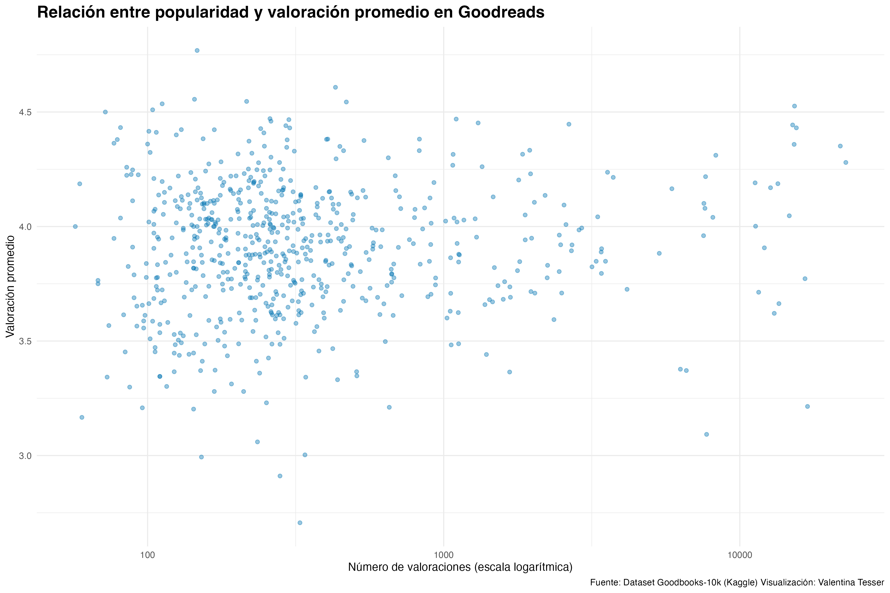
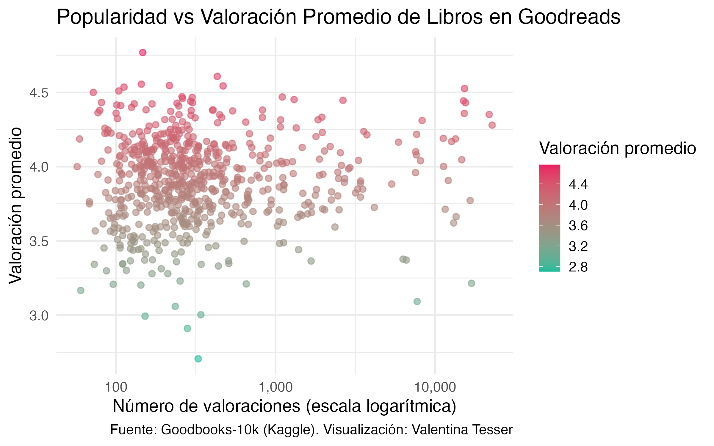
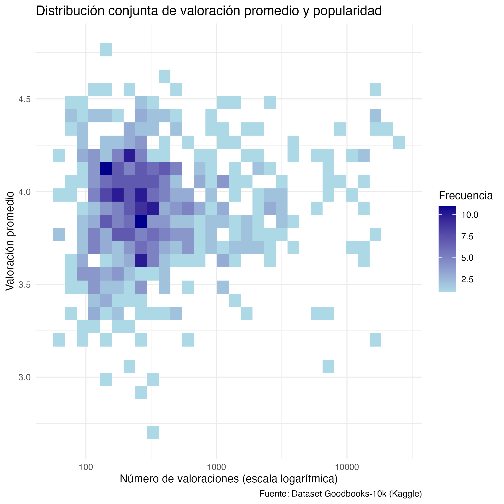
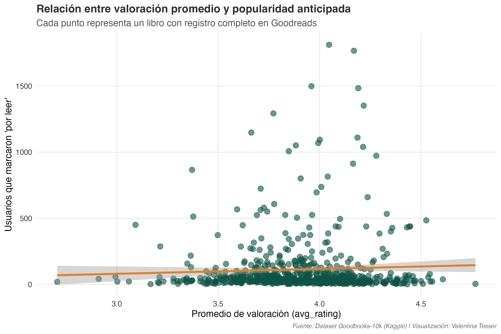
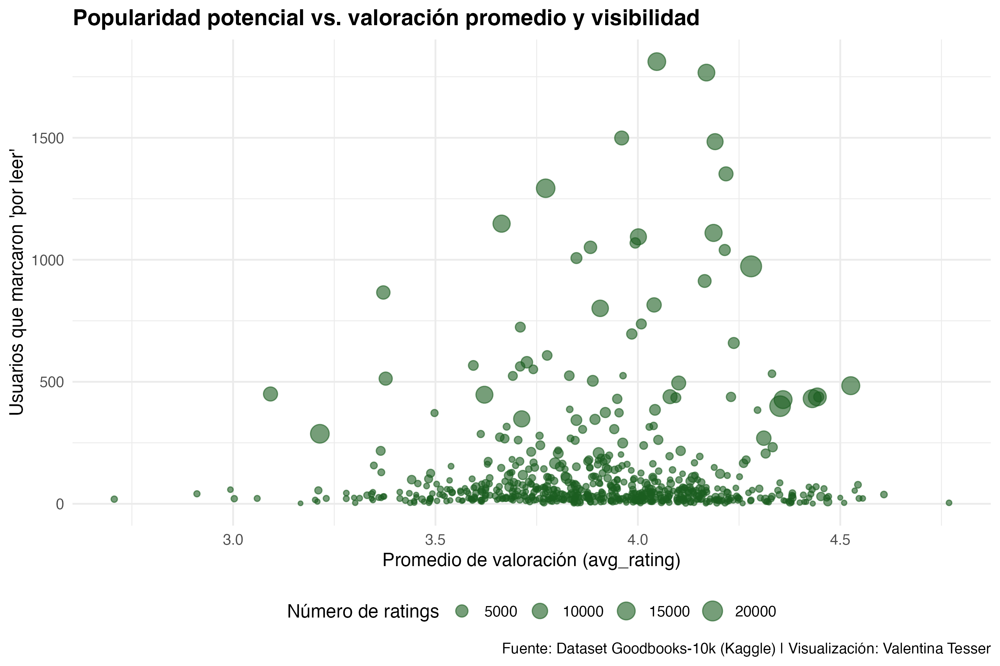
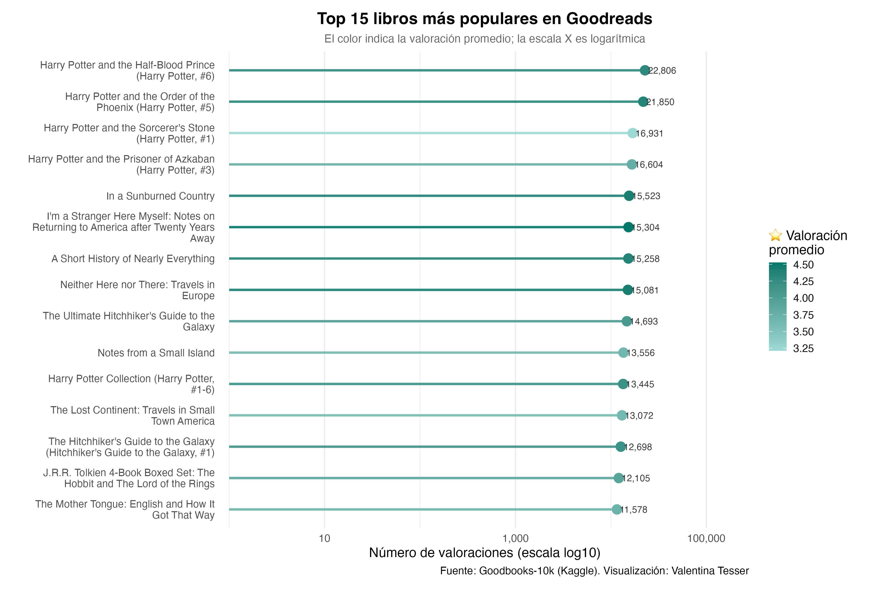
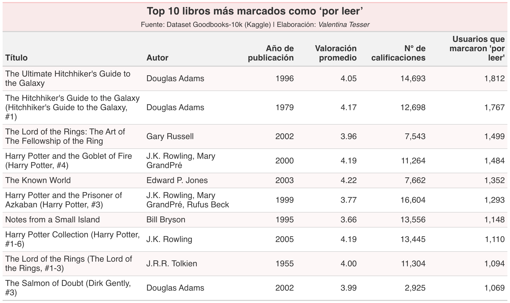
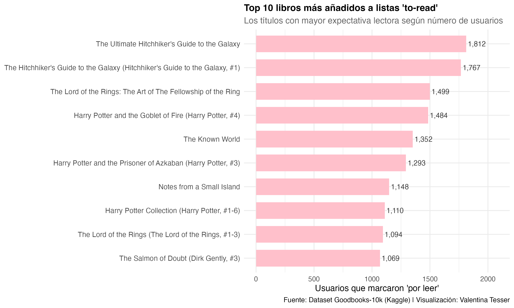
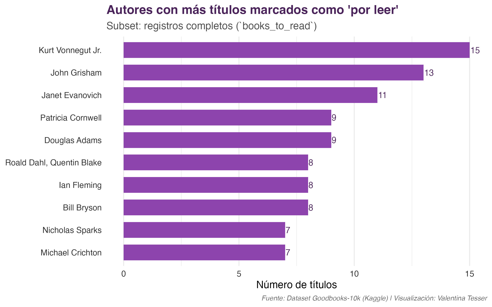
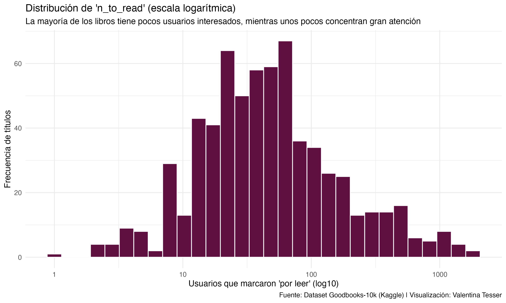

# Explorando el dataset Goodbooks-10k 📚

- Autor: Valentina Tesser
- Fecha última actualización: 23 de octubre de 2025

## 1. Introducción

¿Alguna vez te has preguntado qué tipo de libros son los más populares o cuáles son los que más personas tienen pendientes de leer? En la era digital, estas preguntas pueden responderse no solo con intuiciones, sino también con datos. En este proyecto, me propuse analizar una gran base de datos proveniente de **Goodreads**, una de las plataformas más utilizadas por lectores de todo el mundo para registrar, calificar y recomendar libros.

El dataset que utilicé **Goodbooks-10k**, disponible públicamente en Kaggle (https://www.kaggle.com/datasets/zygmunt/goodbooks-10k), recopila información de más de **10.000 libros** junto con sus autores, valoraciones promedio, número de reseñas, etiquetas (géneros o temas) y datos de interacción de los usuarios, como los libros marcados como por leer. Este tipo de información abre una ventana fascinante para entender los **patrones de lectura y popularidad literaria** a escala global.

Mi idea fue transformar este conjunto de datos en una **historia contada con R**, mostrando paso a paso cómo explorar, limpiar, integrar y analizar información de una fuente real. El objetivo no es solo llegar a conclusiones sobre los gustos literarios, sino también **aprender a manipular datos con herramientas del tidyverse**, de modo que cualquier persona interesada en aprender R pueda seguir este proceso como un tutorial práctico.

A lo largo del análisis, busco responder algunas preguntas que van más allá de la simple curiosidad estadística. Por ejemplo:

- **¿Qué relación existe entre la valoración promedio de un libro y su nivel de popularidad en Goodreads?** 
- **¿Cuáles son los géneros o etiquetas más comunes entre los libros mejor valorados por los usuarios?** 
- **¿Qué características comparten los títulos que más usuarios marcan como “por leer”?** 
- **¿Cómo varían las calificaciones y reseñas según el género, autor y año de publicación?** 

Estas interrogantes combinan el interés cultural por las preferencias lectoras con un enfoque técnico en análisis de datos.

El resultado es un recorrido completo que comienza con la **preparación y limpieza de las bases**, continúa con su **integración y exploración visual**, y culmina con la **interpretación de patrones y tendencias**. Todo el proceso se explica en detalle para que puedas reproducirlo y adaptar las técnicas a tus propios proyectos.

En definitiva, este análisis busca demostrar cómo los datos pueden convertirse en una herramienta poderosa para observar el mundo cultural. A través de Goodreads, podemos entender no solo qué leen las personas, sino también qué **desean leer**, y cómo esas elecciones van moldeando el paisaje literario de una comunidad global interconectada por el amor a los libros.

## 2. Estructura del proyecto

Este proyecto se organiza en distintas fases que reflejan el flujo típico de un **análisis de datos en R**, desde la obtención de la información hasta la comunicación de los resultados. La idea es que cualquier persona que lea este repositorio pueda seguir el proceso paso a paso, entender la lógica detrás de cada decisión y adaptar el código a sus propios intereses.

En la primera etapa, trabajé con los **archivos originales del dataset Goodbooks-10k**, que incluyen información de libros, autores, etiquetas (tags), valoraciones de usuarios y libros marcados como por leer. Estos archivos fueron cargados y explorados para identificar su estructura, variables y posibles problemas de calidad, como valores faltantes o duplicados.

Luego, en la segunda fase, se realizó la **integración de las bases**. Esto implicó conectar las distintas fuentes —por ejemplo, uniendo los identificadores de libros con sus etiquetas o consolidando las valoraciones— para construir una base maestra lista para el análisis. Durante este paso también se seleccionaron las variables más relevantes para responder las preguntas de investigación planteadas, como el promedio de calificaciones, el número de reseñas, el año de publicación y el género principal de cada obra.

Finalmente, el proyecto avanza hacia la fase de análisis y visualización, donde se aplican herramientas de manipulación y graficación (principalmente del paquete tidyverse) para descubrir patrones y tendencias en los datos. Esta parte incluye comparaciones entre géneros literarios, evolución temporal de las publicaciones y exploración de los libros más populares según distintos criterios.

En cada etapa, el código está acompañado de **comentarios explicativos y observaciones sobre los resultados intermedios**, con el fin de que el lector no solo vea qué se hace, sino también por qué se hace. De este modo, el proyecto funciona tanto como un ejercicio práctico de análisis de datos en R como una guía para quienes quieran iniciarse en la exploración de datasets reales.

El repositorio está estructurado de la siguiente manera:
- **Data**: Carpeta que contiene los archivos originales del dataset Goodbooks-10k en formato CSV.
- **Scripts**: Carpeta con los scripts de R utilizados para la limpieza, integración y  análisis de los datos.
- **Data Limpia**: Carpeta donde se guardan las bases de datos ya limpias y listas para el análisis.
- **Outputs**: Carpeta donde se guardan las visualizaciones y resultados generados durante el análisis.
- **README.md**: Este archivo, que proporciona una visión general del proyecto y su estructura

## 3. Base de datos

**Goodbooks-10k dataset**: El dataset Goodbooks-10k es una colección de datos que contiene información sobre más de 10,000 libros, sus autores, calificaciones y etiquetas (tags) asociadas. Este conjunto de datos es ideal para realizar análisis exploratorios y visualizaciones relacionadas con la popularidad y características de los libros.

El dataset incluye los siguientes archivos principales:

- **books.csv**: contiene información sobre los libros, incluyendo sus títulos, autores, años de publicación y calificaciones promedio.
- **books.tags.csv**: contiene etiquetas asociadas a los libros, que pueden ayudar a categorizar y analizar los géneros y temas de los libros.
- **ratings.csv**: contiene las calificaciones que los usuarios han dado a los libros, lo que permite analizar la popularidad y recepción de los libros.
- **tags.csv**: contiene las etiquetas que los usuarios han asignado a los libros, lo que puede proporcionar información adicional sobre los temas y géneros de los libros.
- **to_read.csv**: contiene una lista de libros que los usuarios han marcado para leer en el futuro, lo que puede proporcionar información sobre las tendencias y preferencias de lectura.

Puedes descargar el dataset completo desde Kaggle en el siguiente enlace: https://www.kaggle.com/datasets/zygmunt/goodbooks-10k. Asegúrate de guardar los archivos CSV en la carpeta "Data" del repositorio para que los scripts puedan acceder a ellos correctamente.

### 3.1 Limpieza e integración de las bases de Goodreads

Antes de explorar los datos y crear visualizaciones, se realizó un **proceso de limpieza y preparación** de las cinco bases principales del dataset Goodbooks-10k. Este paso es crucial para asegurar que los análisis sean consistentes y representativos, aunque los detalles del código estén disponibles en los scripts de la carpeta `Scripts`.  

#### 3.1.1 Limpieza de cada base

Durante la limpieza se realizaron las siguientes acciones principales:

- **Filtrado de años válidos:** Se conservaron solo libros publicados entre **1800 y 2017**, eliminando registros fuera de rango o sin año de publicación. Esto garantiza un rango temporal realista según los datos de Goodreads.  
- **Eliminación de duplicados exactos:** Se eliminaron registros duplicados en todas las bases por seguridad, aunque la mayoría de los duplicados se encontraba en la tabla `book_tags`.  
- **Valores críticos faltantes (NA):** Se conservaron únicamente libros con **título y año**, esenciales para cualquier análisis. Otros campos, como ISBN o idioma, se mantienen aunque falten, ya que no afectan el análisis descriptivo principal.  
- **Revisión de idiomas:** Se identificaron los idiomas más frecuentes y se filtraron los libros en **inglés**, que representa la mayoría de los registros. Además, se homogeneizó la etiqueta de idioma para facilitar el análisis.  
- **Selección de variables relevantes:** Se redujo cada base a las columnas esenciales para el análisis, por ejemplo, título, autor, año, calificaciones y etiquetas de libros.  

Como resultado de este proceso, se generaron las bases limpias: `books_clean.csv`, `book_tags_clean.csv`, `tags_clean.csv`, `ratings_clean.csv` y `to_read_clean.csv`, listas para la integración y análisis posterior.

#### 3.1.2 Integración de las bases limpias

Una vez limpias, las cinco bases se **unieron para crear la base final** que contiene toda la información necesaria para análisis exploratorios y visualizaciones. Esta base final se llama `books_final_integrated.csv`, pero en los scripts de visualización se utiliza el nombre **`books_full`**.  

Los pasos clave de la integración fueron:

- **Unión con tags:** Cada libro recibió su **tag principal**, es decir, el género o tema más frecuente según la base `book_tags_clean`.  
- **Agregación de ratings:** Se calculó para cada libro la **valoración promedio** y el **número total de valoraciones**.  
- **Incorporación de “por leer”:** Se sumó la cantidad de usuarios que marcaron cada libro como “por leer”, como indicador de interés potencial.  
- **Verificación final:** La base final contiene **8.130 libros y 15 variables**, con información completa de título, autor, año, idioma, género, calificaciones y métricas de interés de los usuarios. Los valores faltantes se concentran principalmente en libros sin calificaciones o sin registros en “por leer”.  

La base final está disponible en `Data Limpia/books_final_integrated.csv`. Todos los pasos de limpieza e integración están documentados en los scripts de la carpeta `Scripts`, para quienes quieran replicar o profundizar en el proceso.

Esta fase asegura que el análisis posterior y las visualizaciones se realicen sobre un dataset **consistente, integrado y representativo**, facilitando la exploración de patrones de popularidad, valoración y preferencias lectoras en Goodreads.

## 4. Pasos a seguir

Para reproducir el análisis presentado en este proyecto, sigue estos pasos:
1. Clona o descarga este repositorio en tu computadora.
2. Asegúrate de tener R y RStudio instalados.
3. Instala las librerías necesarias si aún no las tienes:
```{r}
install.packages(c(
  "tidyverse",
  "dplyr",
  "ggplot2",
  "readr",
  "tidyr",
  "summarytools",
  "plotly",
  "scales",
  "htmlwidgets",
  "forcats",
  "stringr"
))
```
4. Coloca los archivos CSV del dataset Goodbooks-10k en la carpeta "Data" del repositorio.
5. Abre RStudio y carga los scripts de R desde la carpeta "Scripts" en el orden indicado (limpieza, integración, análisis).
6. Ejecuta los scripts paso a paso, asegurándote de entender cada sección del código y los comentarios explicativos.
7. Revisa los resultados y visualizaciones generados en la carpeta "Outputs".

Siguiendo estos pasos, podrás reproducir el análisis y explorar los datos por ti mismo. No dudes en modificar el código para adaptarlo a tus propias preguntas de investigación o intereses literarios. 

¡Feliz análisis de datos! 📊📚

## 5.Explorando la relación entre valoración y popularidad en Goodreads 📖

Una de las preguntas más interesantes que surgen al analizar el dataset *Goodbooks-10k* es: **¿Qué relación existe entre la valoración promedio de un libro y su nivel de popularidad entre los usuarios?**

En otras palabras, buscamos saber si los libros más populares (aquellos con más calificaciones o reseñas) son también los mejor evaluados.  
Esta pregunta nos permite acercarnos a la dinámica de comportamiento lector dentro de Goodreads: ¿la visibilidad impulsa la valoración positiva, o los usuarios prefieren calificar mejor obras menos masivas?

### 5.1 Limpieza y observaciones iniciales

Antes de comenzar con los gráficos, revisé la estructura de las variables principales del análisis:  

- `avg_rating`: valoración promedio de cada libro.  
- `n_ratings`: número total de valoraciones recibidas.  
- `n_to_read`: número de usuarios que marcaron el libro como *“por leer”*.  

**Observación:**  
`avg_rating` contiene **7474 valores NA**,  
`n_ratings` contiene **7474 valores NA**,  
y `n_to_read` contiene **7475 valores NA**.  

Estos *NA* corresponden a **libros que no han recibido calificaciones ni han sido marcados como “por leer”**. Por lo tanto, en los gráficos siguientes se trabajará solo con los registros completos, utilizando `filter(!is.na(avg_rating))` y `filter(!is.na(n_ratings))` para asegurar que los resultados sean representativos.

### 5.2 Objetivo analítico

El objetivo de esta sección es identificar si existe una relación (lineal o no) entre la *valoración promedio* y la *popularidad* de los libros en Goodreads. Para ello, exploraremos visualmente los datos y luego cuantificaremos la correlación entre ambas variables.

### 5.3 Visualización y analisis:

- [1. Diagrama de dispersión: popularidad vs. valoración promedio](#531-diagrama-de-dispersión-popularidad-vs-valoración-promedio)
- [2. Densidad bivariada: concentración de libros](#532-densidad-bivariada-concentración-de-libros)
- [3. Scatterplot con línea de tendencia (geom_smooth)](#533-scatterplot-con-línea-de-tendencia-geom_smooth)
- [4. Relación entre valoración promedio, popularidad anticipada y visibilidad (`n_ratings`)](#534-relación-entre-valoración-promedio-popularidad-anticipada-y-visibilidad-n_ratings)
- [5. Correlación entre valoración promedio y número de valoraciones](#535-correlación-entre-valoración-promedio-y-número-de-valoraciones)
- [6. Los libros más populares vs. los mejor calificados](#536-los-libros-más-populares-vs-los-mejor-calificados)

#### 5.3.1 Diagrama de dispersión: popularidad vs. valoración promedio

El siguiente gráfico muestra cómo se distribuyen los libros en función de su número de valoraciones (`n_ratings`) y su calificación promedio (`avg_rating`).

```r
library(ggplot2)
library(dplyr)

books_clean <- books_full %>%
  filter(!is.na(avg_rating), !is.na(n_ratings))

grafico_pop <- ggplot(books_clean, aes(x = n_ratings, y = avg_rating)) +
  geom_point(alpha = 0.4, color = "#0072B2") +
  scale_x_log10() +
  labs(
    title = "Relación entre popularidad y valoración promedio en Goodreads",
    x = "Número de valoraciones (escala logarítmica)",
    y = "Valoración promedio",
    caption = "Fuente: Dataset Goodbooks-10k (Kaggle) Visualización: Valentina Tesser"
  ) +
  theme_minimal() +
  theme(
    plot.title = element_text(face = "bold", size = 16)  # negrita y tamaño opcional
  )

# Guardar el gráfico 

ggsave("../Outputs/grafico_populares.png", grafico_pop, width = 10, height = 6, dpi = 300)
```



En el gráfico de dispersión, donde cada punto representa un libro, se observa una alta concentración entre las 100 y 1.000 valoraciones (recordando que el eje X está en escala logarítmica). Esto significa que la mayoría de los títulos del dataset son moderadamente populares, sin llegar a los niveles masivos de lecturas que tienen algunos best-sellers.

En cuanto a las valoraciones promedio (avg_rating), la mayoría de los libros se ubica entre 3,0 y 4,5 estrellas, lo que refleja una tendencia general positiva: los usuarios de Goodreads tienden a evaluar los libros con buenas calificaciones, aunque no con puntuaciones extremas.

También se pueden notar algunos valores atípicos —libros con muchas valoraciones pero calificaciones más bajas, o al contrario, libros con muy pocas valoraciones pero con promedios cercanos a 5 estrellas—. Esto puede deberse a fenómenos distintos: los primeros suelen ser títulos muy conocidos pero polarizantes (por ejemplo, sagas populares o libros con adaptaciones cinematográficas), mientras que los segundos suelen ser libros de nicho, leídos por pocos usuarios pero muy apreciados por ellos.

En síntesis, la concentración de puntos muestra que la mayoría de los libros tiene una recepción positiva pero una visibilidad limitada, y que la popularidad extrema es la excepción.

Igualmente, podemos ver mejor los datos en el siguiente gráfico: 

```{r}
library(plotly)
library(ggplot2)
library(dplyr)
library(scales)
library(htmlwidgets)

p <- ggplot(books_clean, aes(
  x = n_ratings,
  y = avg_rating,
  text = paste(
    "Título:", title,
    "<br>Autor:", authors,
    "<br>Valoración promedio:", round(avg_rating, 1),
    "<br>Número de valoraciones:", n_ratings
  )
)) +
  geom_point(aes(color = avg_rating), alpha = 0.6, size = 2) +
  scale_color_gradient(low = "#1ABC9C", high = "#E91E63") +
  scale_x_log10(labels = scales::comma) +
  labs(
    title = "Popularidad vs Valoración Promedio de Libros en Goodreads",
    x = "Número de valoraciones (escala logarítmica)",
    y = "Valoración promedio",
    color = "Valoración promedio",
    caption = "Fuente: Goodbooks-10k (Kaggle). Visualización: Valentina Tesser"
  ) +
  theme_minimal(base_size = 14)

# Convertir a objeto plotly
ggplotly_p <- ggplotly(p, tooltip = "text")

# Guardar como archivo HTML
saveWidget(ggplotly_p, "../Outputs/grafico_libros_interactivo.html", selfcontained = TRUE)

# Guardar una vista previa estática del gráfico
ggsave("../Outputs/grafico_libros_preview.png", plot = p, width = 8, height = 5)

```


Ademas se puede ver el gráfico interactivo: [Ver gráfico interactivo](https://vtesser.github.io/Proyecto-personal/Outputs/grafico_libros_interactivo.html)

Donde observamos la misma tendencia que en el gráfico anterior, pero con la ventaja de poder explorar cada punto individualmente al pasar el cursor sobre ellos. Esto permite identificar títulos específicos, sus autores y detalles de valoración y popularidad.


#### 5.3.2 Densidad bivariada: concentración de libros

El gráfico siguiente muestra la concentración de títulos en torno a ciertos rangos de popularidad y valoración promedio.

```{r}
library(ggplot2)
library(scales) 

grafico_densidad <- ggplot(books_clean, aes(x = n_ratings, y = avg_rating)) +
  geom_bin2d(bins = 30) +
  scale_x_log10() +
  scale_fill_gradient(low = "lightblue", high = "darkblue") +
  labs(
    title = "Distribución conjunta de valoración promedio y popularidad",
    x = "Número de valoraciones (escala logarítmica)",
    y = "Valoración promedio",
    fill = "Frecuencia",
    caption = "Fuente: Dataset Goodbooks-10k (Kaggle)"
  ) +
  theme_minimal()

# Guardar el gráfico
ggsave("../Outputs/grafico_densidad_bivariada.png", grafico_densidad, width = 10, height = 6, dpi = 300)
```




El gráfico de densidad bivariada muestra prácticamente la misma tendencia que el anterior, pero con una forma diferente de representación. En lugar de mostrar puntos individuales, utiliza cuadrantes de color que representan la concentración de observaciones. Las zonas más oscuras indican donde hay más libros. En este caso, la concentración principal también está entre 100 y 1.000 valoraciones y calificaciones promedio entre 3,5 y 4,3 estrellas, exactamente como en el gráfico anterior. 

Por lo tanto, ambos gráficos entregan la misma información general, pero con distintos propósitos visuales: el diagrama de dispersión es útil para mostrar casos individuales y detectar valores atípicos. Por otro lado, el gráfico de densidad es mejor para mostrar patrones generales de concentración cuando hay muchos datos y los puntos se sobreponen.

#### 5.3.3 Scatterplot con línea de tendencia (geom_smooth)

El siguiente gráfico presenta la relación entre la valoración promedio (`avg_rating`) y el número de usuarios que marcaron el libro como “por leer” (`n_to_read`).

Cada punto representa un libro, mientras que la línea naranja de regresión muestra la tendencia general según un modelo lineal.

```{r}
library(ggplot2)

grafico_relacion_popularidad <- ggplot(books_to_read, aes(x = avg_rating, y = n_to_read)) +
  geom_point(alpha = 0.6, color = "#0B5345", size = 3) +
  geom_smooth(method = "lm", color = "#E67E22", linewidth = 1.2, se = TRUE) +
  labs(
    title = "Relación entre valoración promedio y popularidad anticipada",
    subtitle = "Cada punto representa un libro con registro completo en Goodreads",
    x = "Promedio de valoración (avg_rating)",
    y = "Usuarios que marcaron 'por leer'",
    caption = "Fuente: Dataset Goodbooks-10k (Kaggle) | Visualización: Valentina Tesser"
  ) +
  theme_minimal(base_size = 12) +
  theme(
    plot.title = element_text(face = "bold", color = "#2C2C2C", size = 14),
    plot.subtitle = element_text(color = "gray30"),
    axis.text = element_text(color = "#2C2C2C"),
    panel.grid.minor = element_blank(),
    plot.caption = element_text(size = 8, color = "gray40", face = "italic")
  )

grafico_relacion_popularidad

# Guardar el gráfico en Outputs
ggsave("../Outputs/grafico_relacion_popularidad.png",
       grafico_relacion_popularidad,
       width = 9, height = 6, dpi = 300)
```


El gráfico evidencia una relación positiva débil entre el promedio de valoración de los libros y el número de usuarios que los marcan como “por leer”. La pendiente apenas ascendente de la línea de tendencia sugiere que, en general, los títulos con mejores calificaciones tienden a atraer a más lectores potenciales, aunque la asociación no es lineal ni particularmente fuerte.

Se observan muchos libros con valoración media (entre 3.5 y 4.0) que concentran un rango muy amplio de interés, desde apenas unos pocos registros hasta más de 1500 usuarios. Esto indica que la expectativa lectora no depende exclusivamente de la calidad percibida, sino también de otros factores contextuales, como la popularidad del autor, la existencia de sagas, o el impacto cultural y mediático de ciertos títulos.

En otras palabras, mientras las obras con alta valoración suelen mantener un interés sostenido, la popularidad anticipada parece estar más vinculada a la visibilidad social del libro que a su evaluación crítica. Este hallazgo coincide con el comportamiento típico de plataformas como Goodreads, donde las dinámicas de recomendación, tendencia y fandom pueden influir tanto o más que las métricas de calidad.

#### 5.3.4 Relación entre valoración promedio, popularidad anticipada y visibilidad (`n_ratings`)

El siguiente gráfico añade una tercera dimensión al análisis: el tamaño de los puntos representa el número de calificaciones (`n_ratings`) que ha recibido cada libro, permitiendo visualizar simultáneamente popularidad anticipada (`n_to_read`), valoración promedio (`avg_rating`) y visibilidad efectiva en la plataforma.

```{r}
gráfico_pop_vs_valor_promedio <- ggplot(books_to_read, aes(x = avg_rating, y = n_to_read, size = n_ratings)) +
  geom_point(alpha = 0.6, color = "#1B5E20") +
  scale_size_continuous(name = "Número de ratings") +
  labs(
    title = "Popularidad potencial vs. valoración promedio y visibilidad",
    x = "Promedio de valoración (avg_rating)",
    y = "Usuarios que marcaron 'por leer'",
    caption = "Fuente: Dataset Goodbooks-10k (Kaggle) | Visualización: Valentina Tesser"
  ) +
  theme_minimal(base_size = 12) +
  theme(
    plot.title = element_text(face = "bold"),
    legend.position = "bottom"
  )

gráfico_pop_vs_valor_promedio

# Guardar el gráfico en Outputs
ggsave("../Outputs/gráfico_pop_vs_valor_promedio.png",
       gráfico_pop_vs_valor_promedio,
       width = 9, height = 6, dpi = 300)
```



El gráfico muestra que los libros con mayor cantidad de calificaciones tienden también a ser los más añadidos a las listas “por leer”, evidenciando una relación entre visibilidad y expectativa lectora.

Aunque existen algunos títulos con alta valoración pero baja notoriedad —indicando interés de nichos más pequeños—, la tendencia general sugiere que la popularidad potencial se concentra en obras ampliamente difundidas o de culto.

Esto refuerza la idea de que el interés por leer un libro no depende solo de su calidad percibida, sino también de factores sociales, mediáticos y de reconocimiento del autor o la saga. 

#### 5.3.5 Correlación entre valoración promedio y número de valoraciones

```{r}
cor_test <- cor.test(books_clean$avg_rating, books_clean$n_ratings, use = "complete.obs")
cor_test
```

Se evaluó la relación entre la valoración promedio de los libros y su número de valoraciones en Goodreads utilizando el coeficiente de correlación de Pearson.

| Estadístico                    | Valor            |
| ------------------------------ | ---------------- |
| Coeficiente de correlación (r) | **0.086**        |
| Grados de libertad (df)        | 654              |
| Estadístico t                  | 2.22             |
| p-valor                        | 0.027            |
| Intervalo de confianza (95%)   | [0.0099, 0.1619] |


La correlación entre la valoración promedio (avg_rating) y la popularidad (n_ratings) es positiva pero muy débil (r = 0.086).
Aunque el p-value (< 0.05) indica que la relación es estadísticamente significativa, su magnitud es tan baja que no tiene una relevancia práctica fuerte.

En otras palabras, los libros más populares tienden a tener ligeramente mejores calificaciones, pero esta relación es mínima. Esto sugiere que la popularidad no necesariamente se explica por la calidad percibida, sino también por otros factores —como la promoción editorial, la fama del autor o la pertenencia a géneros con grandes comunidades lectoras—.

#### 5.3.6 Los libros más populares vs. los mejor calificados

Finalmente, podemos visualizar los títulos que lideran ambos rankings y comparar si coinciden o no.

```{r}
library(dplyr)
library(ggplot2)
library(forcats)
library(stringr)
library(scales)

# Libros más populares
top_popular <- books_clean %>%
  arrange(desc(n_ratings)) %>%
  slice_head(n = 15)

# Libros mejor calificados (mínimo 1000 valoraciones)
top_rated <- books_clean %>%
  filter(n_ratings > 1000) %>%
  arrange(desc(avg_rating)) %>%
  slice_head(n = 15)

# Crear el gráfico y guardarlo en un objeto
grafico_top15 <- ggplot(top_books, aes(y = title_wrapped, x = n_ratings_plot, color = avg_rating)) +
  geom_segment(aes(x = 1, xend = n_ratings_plot, y = title_wrapped, yend = title_wrapped),
               linewidth = 1.1, alpha = 0.9) +
  geom_point(size = 4) +
  geom_text(aes(label = scales::comma(n_ratings)), hjust = -0.1, size = 3.2, color = "gray20") +
  scale_x_continuous(trans = "log10", labels = scales::comma, expand = expansion(mult = c(0.02, 0.25))) +
  scale_color_gradient(low = "#9DD9D2", high = "#00796B", name = "⭐ Valoración\npromedio") +
  labs(
    title = "Top 15 libros más populares en Goodreads",
    subtitle = "El color indica la valoración promedio; la escala X es logarítmica",
    x = "Número de valoraciones (escala log10)",
    y = "",
    caption = "Fuente: Goodbooks-10k (Kaggle). Visualización: Valentina Tesser"
  ) +
  theme_minimal(base_size = 13) +
  theme(
    plot.title = element_text(face = "bold", size = 16, hjust = 0.5),
    plot.subtitle = element_text(size = 11, hjust = 0.5, color = "gray40"),
    axis.text.y = element_text(size = 10, margin = margin(r = 6)),
    legend.position = "right",
    plot.margin = margin(t = 12, r = 30, b = 12, l = 12),
    panel.grid.major.y = element_blank()
  ) +
  coord_cartesian(clip = "off")

# Guardar el gráfico en la carpeta del proyecto
ggsave("../Outputs/grafico_top15_populares.png", grafico_top15, width = 12, height = 8, dpi = 300)
```



El gráfico muestra los 15 libros con mayor número de valoraciones en Goodreads, utilizando una escala logarítmica para representar la cantidad de calificaciones que cada título ha recibido. El color de los puntos indica la valoración promedio otorgada por los usuarios, permitiendo comparar simultáneamente popularidad y nivel de aprobación.

Se observa que algunos títulos son ampliamente populares, acumulando cientos de miles o incluso millones de valoraciones, mientras que su promedio de calificación no siempre es el más alto. Esto sugiere que la popularidad no necesariamente refleja una mejor percepción de calidad por parte de los lectores. En cambio, existen libros con un número más moderado de valoraciones que obtienen puntuaciones notablemente superiores.

Este patrón evidencia que el interés masivo por ciertos títulos —probablemente impulsado por fenómenos editoriales, adaptaciones cinematográficas o autores reconocidos— no siempre se traduce en una evaluación más positiva. Por tanto, la popularidad en Goodreads parece estar asociada tanto a factores culturales y mediáticos como a la valoración literaria en sí misma.

En resumen, la relación entre popularidad y valoración es compleja: los libros más leídos y comentados no necesariamente son los más apreciados, lo que refleja la diversidad de gustos y expectativas dentro de la comunidad lectora de Goodreads.

### 5.4 Conclusión: Valoración vs. Popularidad

La pregunta central que orientó esta sección fue: **¿Qué relación existe entre la valoración promedio de un libro y su nivel de popularidad entre los usuarios de Goodreads?**

El análisis realizado permite afirmar que dicha relación no es lineal ni directa. Si bien se observa una tendencia positiva débil —los libros con mejores calificaciones tienden, en promedio, a atraer más lectores potenciales y a recibir más reseñas—, los datos muestran una alta dispersión que evidencia la complejidad de las dinámicas de visibilidad en esta plataforma.

Los gráficos de dispersión y densidad bivariada demostraron que la mayoría de los títulos se concentran en valoraciones medias-altas (entre 3,5 y 4,3 estrellas) y niveles moderados de popularidad, mientras que solo un pequeño grupo de libros —las excepciones o outliers— alcanza cifras de interés masivo. Estos casos suelen corresponder a franquicias literarias, autores de culto o libros con adaptaciones mediáticas, lo que sugiere que la notoriedad pública del título es un determinante más fuerte que la calidad literaria percibida.

La correlación estadística entre valoración promedio y número de valoraciones **(r = 0.086)** confirma esta observación: aunque la relación es estadísticamente significativa, su magnitud es muy baja, lo que implica que la popularidad no depende estrictamente de la valoración positiva, sino de un conjunto más amplio de factores sociales y culturales.

Asimismo, el gráfico que incorpora el número de calificaciones como medida de visibilidad refuerza la existencia de un fenómeno de retroalimentación social o de “popularidad acumulativa”, donde los libros más visibles tienden a ser aún más visibles. Esto se alinea con el patrón conocido como winner takes all (“el ganador se lo lleva todo”), propio de los entornos digitales: un número reducido de obras concentra la atención, los comentarios y las futuras lecturas, mientras la mayoría permanece con baja exposición.

Finalmente, el análisis comparativo de los títulos más populares y los mejor calificados muestra que la masividad y la apreciación crítica rara vez coinciden. Algunos libros logran millones de valoraciones con calificaciones promedio moderadas, mientras que otros, altamente valorados, permanecen en nichos reducidos. Esto revela que la lectura en Goodreads opera también como un acto social: un espacio donde la visibilidad mediática, la pertenencia a comunidades lectoras y el interés cultural compartido influyen tanto o más que la calidad literaria.

En síntesis, los libros que concentran mayor interés potencial en Goodreads combinan tres dimensiones clave:

- **Alta visibilidad social y mediática**, que amplifica su alcance más allá de los circuitos literarios.

- **Pertenencia a sagas, colecciones o autores de culto**, que aseguran reconocimiento y fidelidad de lectores.

- **Valoraciones positivas —aunque no necesariamente excepcionales—**, que validan el interés sin ser su causa principal.

Este conjunto de hallazgos sugiere que en Goodreads, como en otros ecosistemas digitales, la popularidad anticipada responde más a dinámicas de visibilidad, reputación y consumo cultural compartido que a juicios estrictamente literarios. En consecuencia, la plataforma refleja no solo preferencias de lectura, sino también procesos sociales de reconocimiento, legitimación y pertenencia simbólica dentro de una comunidad global de lectores.

## 6. Entre el deseo y la visibilidad: el mapa del interés lector en Goodreads ✨📖

En el ecosistema digital de Goodreads, no solo importan los libros que han sido leídos, sino también aquellos que los usuarios desean leer. Este análisis parte de una pregunta clave: **¿qué factores explican que ciertos títulos despierten una mayor expectativa lectora y sean añadidos con más frecuencia a las listas "to-read"?**

La variable `n_to_read` ofrece una mirada distinta a la dinámica del consumo cultural: en lugar de reflejar experiencias de lectura efectivas (como las variables `avg_rating` o `n_ratings`), captura una **dimensión anticipatoria del comportamiento lector**, vinculada con el deseo, la curiosidad o el interés proyectado hacia determinadas obras.

Explorar esta variable permite comprender cómo se construye la visibilidad literaria antes incluso de que se produzca la lectura. En este sentido, el análisis combina una revisión descriptiva de los títulos más añadidos, la identificación de autores recurrentes y la observación de patrones de concentración (*“winner takes all”*), para indagar cómo se distribuye el interés lector y qué características comparten los libros con mayor potencial de atención.

## 6.1 Limpieza y observaciones iniciales

Antes de comenzar el análisis, se definieron las variables principales involucradas:

- `n_to_read`: número de usuarios que añadieron un libro a su lista “por leer” (indicador de interés potencial).

- `avg_rating`: valoración promedio otorgada por los lectores.

- `n_ratings`: número total de calificaciones recibidas.

**Observación**:

El dataset filtrado (`books_to_read`) incluye **655 observaciones completas** que contienen valores válidos en las tres variables. Se excluyeron los registros con valores faltantes (NA) para asegurar la coherencia del análisis descriptivo y visual.

```{r}
books_to_read <- books_full %>%
  filter(!is.na(avg_rating), !is.na(n_ratings), !is.na(n_to_read))

# books_to_read contiene 655 obs. de 15 variables
```

### 6.2 Objetivo analítico

El propósito de esta sección es **caracterizar los libros con mayor interés potencial de lectura en Goodreads**, explorando los factores que inciden en su atractivo anticipado y su relación con la popularidad y la valoración crítica.

Concretamente, se busca responder a tres preguntas centrales:

- ¿Qué títulos y autores concentran la mayor cantidad de usuarios interesados en leerlos?

- ¿Qué tipo de obras —sagas, clásicos, best-sellers o títulos de culto— dominan las listas “to-read”?

- ¿Existe una concentración significativa del interés lector (efecto winner takes all) o el deseo de lectura se distribuye de forma más equilibrada entre los libros?

El análisis se abordará a través de visualizaciones descriptivas y reflexiones interpretativas que permiten vincular los resultados con dinámicas socioculturales del consumo literario digital.

### 6.3 Visualización y análisis:

- [1. Identificación de los libros más marcados como “por leer”](#631-identificación-de-los-libros-más-marcados-como-por-leer)
- [2. Autores con mayor presencia en las listas “to-read”](#632-qué-autores-aparecen-más-en-el-top-y-qué-tipo-de-obras-son)
- [3. Distribución del interés lector y efecto “winner takes all”](#633-explorar-concentración-efecto-winner-takes-all)


#### 6.3.1 Identificación de los libros más marcados como “por leer”

A continuación, se identifican los títulos con mayor número de usuarios que los agregaron a su lista “to-read”.

Esto permite detectar qué obras concentran la mayor expectativa o curiosidad lectora, independientemente de si han sido efectivamente leídas o calificadas.

```{r}
top_to_read <- books_to_read %>%
  arrange(desc(n_to_read)) %>%
  select(title, authors, original_publication_year, avg_rating, n_ratings, n_to_read) %>%
  head(10)
top_to_read
```

Visualizamos lo anterior en la siguiente tabla:

```{r}
library(dplyr)
library(gt)

# Crear tabla GT
tabla_top_to_read <- books_to_read %>%
  arrange(desc(n_to_read)) %>%
  select(
    Título = title,
    Autor = authors,
    "Año de publicación" = original_publication_year,
    "Valoración promedio" = avg_rating,
    "N° de calificaciones" = n_ratings,
    "Usuarios que marcaron 'por leer'" = n_to_read
  ) %>%
  head(10) %>%
  gt() %>%
  fmt_number(columns = c("Valoración promedio"), decimals = 2) %>%
  fmt_number(columns = c("N° de calificaciones", "Usuarios que marcaron 'por leer'"),
             decimals = 0, use_seps = TRUE) %>%
  tab_header(
    title = md("**Top 10 libros más marcados como 'por leer'**"),
    subtitle = md("Fuente: Dataset Goodbooks-10k (Kaggle) | Elaboración: *Valentina Tesser*")
  ) %>%
  tab_style(style = cell_text(weight = "bold"),
            locations = cells_column_labels()) %>%
  tab_options(
    table.border.top.width = 2,
    table.border.top.color = "#F7C6C7",
    table.border.bottom.color = "#F7C6C7",
    table.background.color = "white",
    heading.background.color = "#F9EAEA",
    column_labels.background.color = "#F2F2F2",
    table.font.names = "Helvetica",
    data_row.padding = px(5)
  ) %>%
  tab_style(
    style = cell_fill(color = "#FDF7F7"),
    locations = cells_body(rows = seq(1, 10, 2))
  )

# Guardar como imagen
gtsave(tabla_top_to_read, "../Outputs/tabla_top_to_read.png")
```



Asi mismo, podemos visualizar la información presentada en un gráfico de barras: 

```{r}
# Barra horizontal del top 10 "to-read"

gráfico_top_to_read <- ggplot(top_to_read, aes(x = reorder(title, n_to_read), y = n_to_read)) +
geom_col(fill = "pink", width = 0.7) +
geom_text(aes(label = scales::comma(n_to_read)),
hjust = -0.1, size = 3.5, color = "gray20") +
coord_flip() +
labs(
title = "Top 10 libros más añadidos a listas 'to-read'",
subtitle = "Los títulos con mayor expectativa lectora según número de usuarios",
x = NULL,
y = "Usuarios que marcaron 'por leer'",
caption = "Fuente: Dataset Goodbooks-10k (Kaggle) | Visualización: Valentina Tesser"
) +
theme_minimal(base_size = 12) +
theme(
plot.title = element_text(face = "bold", size = 13),
plot.subtitle = element_text(color = "gray40"),
axis.text.y = element_text(size = 10)
) +
expand_limits(y = max(top_to_read$n_to_read) * 1.15)

## Guardar gráfico 
ggsave("../Outputs/gráfico_top_to_read.png", gráfico_top_to_read, width = 10, height = 6, dpi = 300)
```



El gráfico permite identificar los títulos que concentran una mayor expectativa lectora dentro del conjunto analizado, es decir, aquellos que más usuarios han añadido a sus listas `to-read`. Se observa una clara concentración en unos pocos libros que acumulan un número significativamente mayor de marcas “por leer”, lo que sugiere un patrón de tipo winner takes all, donde la atención se distribuye de forma desigual entre un pequeño grupo de obras altamente reconocidas.

Los resultados muestran una fuerte presencia de sagas literarias y universos narrativos consolidados, destacando las series The Hitchhiker’s Guide to the Galaxy, Harry Potter y The Lord of the Rings. Esta tendencia indica que la popularidad potencial se asocia estrechamente a títulos que ya cuentan con una base de lectores fieles y con una fuerte visibilidad mediática. Asimismo, aparecen ediciones especiales o complementarias —como The Lord of the Rings: The Art of the Fellowship of the Ring o Harry Potter Collection— que revelan un interés no solo por la lectura en sí, sino también por el componente coleccionable y simbólico de ciertos volúmenes.

Junto a estas obras de culto, emergen algunos casos que se apartan de la lógica dominante, como The Known World o Notes from a Small Island, que pertenecen a géneros más realistas (ficción histórica y literatura de viajes, respectivamente). Su presencia sugiere que la expectativa lectora también puede responder a factores de prestigio crítico o a la trayectoria de autores reconocidos, más allá de la popularidad de una saga.

En conjunto, los resultados permiten concluir que los libros más añadidos a listas “to-read” tienden a ser obras canónicas o altamente visibles, reforzando la idea de que la popularidad potencial en Goodreads reproduce dinámicas de notoriedad cultural. En este sentido, el interés lector anticipado parece vincularse menos con la novedad editorial y más con el capital simbólico acumulado de ciertos títulos y autores.

#### 6.3.2 ¿Qué autores aparecen más en el top y qué tipo de obras son?

El objetivo de este análisis es identificar qué autores concentran la mayor cantidad de títulos dentro del subconjunto books_to_read. Esto permite observar si el interés lector se organiza en torno a autores “de culto” o sagas reconocidas, más que a géneros o temáticas específicas.

```{r}
library(ggplot2)
library(dplyr)

# Calcular los autores más frecuentes
authors_freq <- books_to_read %>%
  mutate(main_author = authors) %>%
  count(main_author, sort = TRUE) %>%
  slice_head(n = 10)

# Gráfico en tonos morados
grafico_top_autores <- ggplot(authors_freq, aes(x = reorder(main_author, n), y = n)) +
  geom_col(fill = "#8E44AD", width = 0.7) +
  geom_text(aes(label = n), hjust = -0.1, color = "#4A235A", size = 3.5) +
  coord_flip() +
  labs(
    title = "Autores con más títulos marcados como 'por leer'",
    subtitle = "Subset: registros completos (`books_to_read`)",
    x = NULL,
    y = "Número de títulos",
    caption = "Fuente: Dataset Goodbooks-10k (Kaggle) | Visualización: Valentina Tesser"
  ) +
  theme_minimal(base_size = 12) +
  theme(
    plot.title = element_text(face = "bold", color = "#4A235A"),
    plot.subtitle = element_text(color = "gray30"),
    panel.grid.major.y = element_blank(),
    axis.text = element_text(color = "#2C2C2C"),
    plot.caption = element_text(size = 8, color = "gray40", face = "italic")
  )

# Mostrar gráfico
grafico_top_autores

# Guardar gráfico
ggsave("../Outputs/grafico_top_autores.png", grafico_top_autores, width = 8, height = 5, dpi = 300)
```


El gráfico muestra a los autores con mayor presencia dentro del subconjunto de libros marcados como “por leer”. Se destacan Kurt Vonnegut Jr., John Grisham, Janet Evanovich, Douglas Adams y Patricia Cornwell, quienes lideran el interés con entre 9 y 15 títulos cada uno.

Esta concentración sugiere que las preferencias lectoras se articulan principalmente en torno a nombres consolidados o franquicias literarias, más que a obras individuales o géneros emergentes. En particular, Vonnegut y Adams representan autores de culto con estilos narrativos distintivos y comunidades lectoras fieles, mientras que Grisham, Cornwell y Evanovich destacan por su producción prolífica y popularidad comercial dentro de la ficción contemporánea.

En conjunto, el patrón indica un fenómeno de reconocimiento de marca autoral: los usuarios tienden a añadir a sus listas “to-read” múltiples obras de los mismos escritores, reforzando la idea de que la visibilidad mediática y la familiaridad con el autor son factores determinantes en la formación de expectativas lectoras.

#### 6.3.3 Explorar concentración (efecto “winner takes all”)

Con el fin de complementar el análisis anterior, este apartado explora la distribución del número de usuarios que marcan los libros como “por leer” (`n_to_read`). El objetivo es observar si el interés potencial se reparte de manera equilibrada o si, por el contrario, unos pocos títulos concentran una proporción desproporcionada de la atención.

```{r}
winner_takes_all <- ggplot(books_to_read, aes(x = n_to_read)) +
geom_histogram(bins = 30, fill = "#5f0f40", color = "white") +
scale_x_log10() +
labs(
title = "Distribución de 'n_to_read' (escala logarítmica)",
subtitle = "La mayoría de los libros tiene pocos usuarios interesados, mientras unos pocos concentran gran atención",
x = "Usuarios que marcaron 'por leer' (log10)",
y = "Frecuencia de títulos",
caption = "Fuente: Dataset Goodbooks-10k (Kaggle) | Visualización: Valentina Tesser"
) +
theme_minimal(base_size = 12)

winner_takes_all

# Guardar salida
ggsave("../Outputs/winner_takes_all.png", winner_takes_all, width = 10, height = 6, dpi = 300)
```


El histograma con escala logarítmica revela una distribución fuertemente sesgada del interés lector. La mayor parte de los libros cuenta con pocos usuarios que los han marcado como “por leer”, mientras que un grupo muy reducido concentra niveles extraordinarios de atención. Esto indica que, dentro del catálogo de Goodreads, el interés potencial se distribuye de manera desigual: la visibilidad y el deseo lector tienden a acumularse en unos pocos títulos de alto reconocimiento, mientras la mayoría permanece en la periferia.

Este patrón refleja lo que en sociología y economía cultural se denomina fenómeno winner takes all (literalmente, “el ganador se lleva todo”). Se trata de un tipo de dinámica en la que pequeñas diferencias iniciales en popularidad o exposición —por ejemplo, la fama del autor, la adaptación cinematográfica o el marketing— se amplifican a través de mecanismos de retroalimentación social. En entornos digitales, los algoritmos de recomendación, las reseñas masivas y la visibilidad en rankings tienden a reforzar el éxito de los títulos más vistos, generando un círculo virtuoso de atención para unos pocos y un efecto de invisibilidad para la mayoría.

En el caso de Goodreads, este fenómeno sugiere que el interés por leer un libro no depende tanto de su calidad literaria o valoración crítica, sino de su capacidad para insertarse en redes de difusión y conversación. Así, unos pocos libros —generalmente best-sellers o sagas de culto— capturan la mayor parte del entusiasmo lector, consolidando un panorama de fuerte concentración simbólica donde la popularidad se convierte en un recurso escaso y autorreforzante.

### 6.4 Conclusión pregunta 3

La pregunta que orientó este análisis — **¿qué factores caracterizan a los libros que concentran mayor interés potencial de lectura en Goodreads, y cómo se relacionan con su valoración y visibilidad dentro del dataset?**— permite comprender una dimensión clave del comportamiento lector contemporáneo: la manera en que los usuarios proyectan su atención y deseo antes de leer.

Los resultados muestran que el interés anticipado se concentra en un grupo reducido de títulos que ya cuentan con alta visibilidad cultural, reforzando un patrón de concentración simbólica. Obras pertenecientes a sagas literarias consolidadas, como Harry Potter, The Lord of the Rings o The Hitchhiker’s Guide to the Galaxy, dominan las listas “to-read”, acompañadas por autores de gran renombre o trayectoria reconocida. Esta presencia constante sugiere que la expectativa lectora no surge de la novedad editorial, sino del capital simbólico acumulado por ciertos universos narrativos y figuras autorales.

El análisis también evidencia un fenómeno de “winner takes all”, donde un pequeño conjunto de libros concentra la mayoría del interés potencial. Este patrón refleja dinámicas propias de los entornos digitales, donde la atención se distribuye de forma desigual y los mecanismos de recomendación, visibilidad mediática y reputación colectiva amplifican las diferencias iniciales entre obras. En este contexto, la popularidad potencial —medida por el número de usuarios que desean leer un libro— actúa como un indicador de prestigio anticipado, más vinculado a la circulación simbólica que a la calidad literaria o a la experiencia de lectura efectiva.

En síntesis, los libros más marcados como “por leer” representan una intersección entre deseo, visibilidad y legitimidad cultural. Goodreads funciona así como un espejo del ecosistema editorial contemporáneo, donde las expectativas lectoras se moldean tanto por la curiosidad individual como por la fuerza de los circuitos de notoriedad colectiva. La anticipación del acto de leer se convierte en una práctica social en sí misma: una forma de participar en la cultura literaria global antes incluso de abrir un libro.

## 7. Desarrollar pregunta 4

## 8. Conclusiones finales


